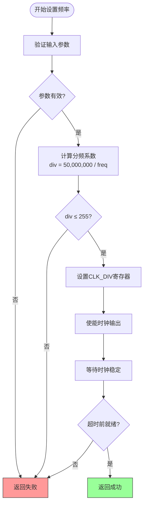
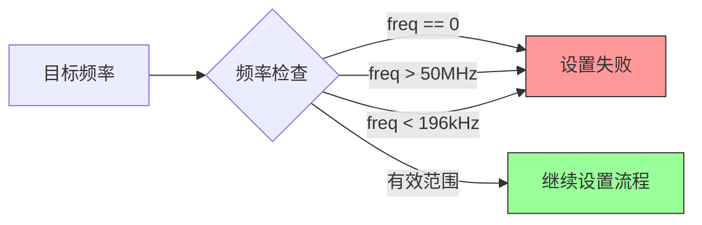
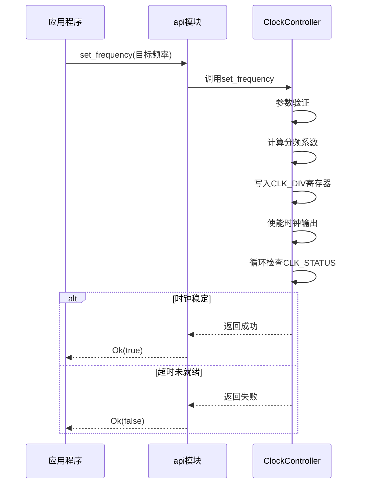
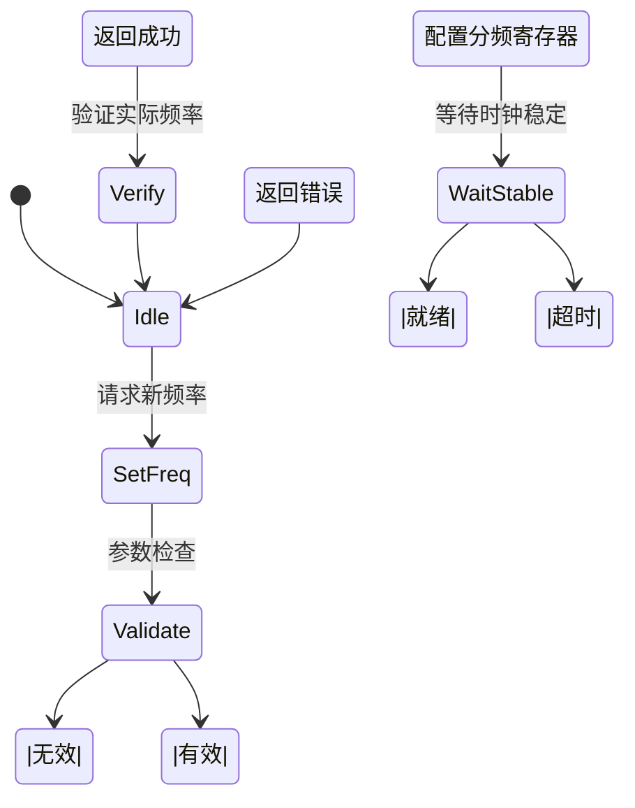

# 频率管理策略

<cite>
**Referenced Files in This Document**   
- [lib.rs](file://src/lib.rs)
- [basic_usage.rs](file://examples/basic_usage.rs)
- [README.md](file://README.md)
</cite>

## 目录
1. [引言](#引言)
2. [核心机制解析](#核心机制解析)
3. [有效频率范围](#有效频率范围)
4. [最佳实践指南](#最佳实践指南)
5. [错误处理与验证](#错误处理与验证)
6. [示例分析](#示例分析)
7. [总结](#总结)

## 引言
本文档详细阐述了飞腾派平台时钟驱动中`set_frequency(freq)`函数的内部工作机制及使用最佳实践。基于50MHz系统时钟通过分频实现频率调节，本驱动提供了对硬件时钟的精确控制能力。文档重点说明了分频系数计算、有效频率范围、稳定性保障措施以及开发者应遵循的操作规范。

## 核心机制解析
时钟频率设置的核心在于分频技术的应用。驱动通过配置硬件寄存器中的分频系数来实现目标频率输出。

### 分频原理
系统采用固定50MHz主时钟作为输入源，通过可编程分频器生成所需频率：
- 分频系数计算公式：`SYS_CLK_HZ / freq`
- 最大允许分频系数：255
- 实际分频值写入`CLK_DIV`寄存器的低8位

**Diagram sources**
- [lib.rs](file://src/lib.rs#L100-L150)

**Section sources**
- [lib.rs](file://src/lib.rs#L100-L150)

## 有效频率范围
由于分频系数限制在1-255之间，决定了可用的输出频率区间。

### 频率边界计算
| 极值类型 | 计算方式 | 结果 |
|---------|---------|------|
| 最高频率 | 50,000,000 / 1 | 50 MHz |
| 最低频率 | 50,000,000 / 255 | 196,078 Hz |

因此，有效的可设置频率范围为 **196,078 Hz 至 50 MHz**。

### 边界条件处理
当请求频率超出此范围或为零时，`set_frequency`函数将直接返回失败，确保不会向硬件写入非法值。

**Diagram sources**
- [lib.rs](file://src/lib.rs#L105-L110)

**Section sources**
- [lib.rs](file://src/lib.rs#L105-L110)

## 最佳实践指南
为确保系统稳定运行，开发者应遵循以下操作建议。

### 避免频繁切换
频繁调用频率切换可能导致系统不稳定：
- 每次频率变更都会触发硬件重新锁定过程
- 过于密集的变更可能使时钟无法稳定
- 建议两次频率设置间加入适当延时

### 推荐操作序列
标准的安全操作流程如下：

**Diagram sources**
- [lib.rs](file://src/lib.rs#L100-L160)
- [basic_usage.rs](file://examples/basic_usage.rs#L20-L30)

**Section sources**
- [lib.rs](file://src/lib.rs#L100-L160)

## 错误处理与验证
完善的错误检测和状态验证机制是可靠操作的关键。

### 设置后验证
每次设置频率后，强烈建议执行双重验证：
1. 使用`get_frequency()`确认实际输出频率
2. 调用`is_ready()`确保时钟已完全稳定

这种验证模式能有效防止因硬件未及时响应而导致的误判。

### 非法输入防护
驱动内置多重保护机制：
- 零频率输入直接拒绝
- 超出范围的频率值不予处理
- 分频系数超过255的情况被拦截

这些检查保证了只有合法且可行的配置才能传递给底层硬件。

**Section sources**
- [lib.rs](file://src/lib.rs#L105-L115)
- [lib.rs](file://src/lib.rs#L170-L180)

## 示例分析
参考`basic_usage.rs`中的循环测试场景，展示了正确的使用模式。

### 示例代码结构
该示例演示了动态调整频率的完整流程：
- 初始化时钟控制器
- 依次尝试多个预设频率
- 对每个设置操作进行结果验证
- 输出详细的日志信息用于调试

特别值得注意的是，在循环中对每个频率设置都进行了完整的验证流程，包括获取当前频率和检查就绪状态，这正是推荐的最佳实践。

**Diagram sources**
- [basic_usage.rs](file://examples/basic_usage.rs#L40-L60)
- [lib.rs](file://src/lib.rs#L100-L160)

**Section sources**
- [basic_usage.rs](file://examples/basic_usage.rs#L40-L60)

## 总结
正确使用`set_frequency(freq)`函数需要理解其背后的硬件机制和约束条件。关键要点包括：
- 有效频率范围由分频系数上限决定（196kHz - 50MHz）
- 必须避免过于频繁的频率切换以维持系统稳定性
- 每次设置后应使用`get_frequency()`和`is_ready()`进行验证
- 非法频率值（如0或超限）会导致设置失败
- 参考`basic_usage.rs`中的模式，在循环测试等场景下加入适当延时

遵循这些最佳实践可确保时钟系统的可靠运行，避免潜在的稳定性问题。