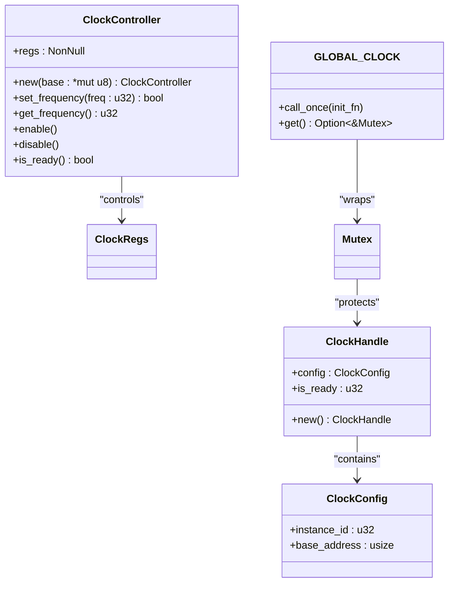
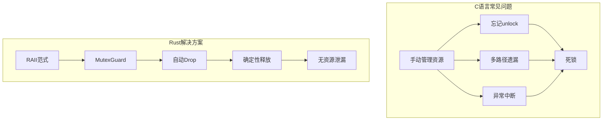
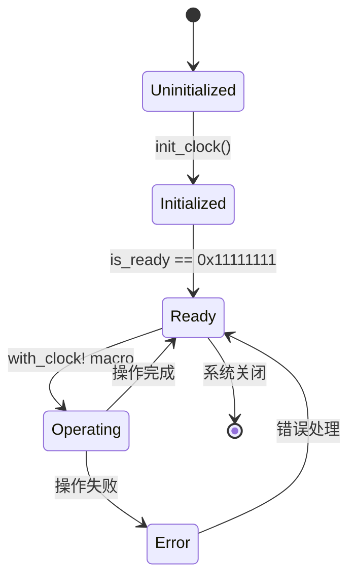

# RAII模式与资源生命周期

<cite>
**Referenced Files in This Document**  
- [lib.rs](file://src/lib.rs)
- [Cargo.toml](file://Cargo.toml)
- [README.md](file://README.md)
</cite>

## 目录
1. [RAII范式在驱动中的体现](#raii范式在驱动中的体现)
2. [ClockHandle的初始化状态管理](#clockhandle的初始化状态管理)
3. [MutexGuard的自动释放机制](#mutexguard的自动释放机制)
4. [与传统C语言资源管理的对比](#与传统c语言资源管理的对比)
5. [Send + Sync的安全跨线程传递](#send--sync的安全跨线程传递)

## RAII范式在驱动中的体现

Rust的RAII（Resource Acquisition Is Initialization）范式在本时钟驱动中得到了充分体现。该范式确保资源的生命周期与其所有者的生命周期严格绑定，当所有者离开作用域时，资源会自动被清理。

在`ClockController`结构体的设计中，通过将寄存器指针包装为`NonNull<ClockRegs>`类型，实现了对硬件资源的安全抽象。这种设计避免了裸指针的直接暴露，同时利用Rust的所有权系统确保了内存安全。当`ClockController`实例被销毁时，其持有的资源也会被正确处理。

驱动中的全局时钟实例`GLOBAL_CLOCK`使用`Once<Mutex<ClockHandle>>`进行管理，这体现了RAII与延迟初始化的结合。`Once`类型保证了初始化操作只会执行一次，而`Mutex`则提供了线程安全的访问控制。



**Diagram sources**  
- [lib.rs](file://src/lib.rs#L70-L165)

**Section sources**  
- [lib.rs](file://src/lib.rs#L70-L165)

## ClockHandle的初始化状态管理

`ClockHandle`结构体通过`is_ready`标志位精确管理时钟控制器的初始化状态，确保未初始化时拒绝任何操作请求。这一设计有效防止了对未配置硬件的非法访问。

`is_ready`字段采用魔数`0x11111111u32`作为已初始化状态的标记，这是一种常见的嵌入式系统编程实践。初始值为0表示未初始化状态，当调用`init_clock`函数成功后，该值被设置为魔数，表明时钟系统已准备就绪。

在`with_clock!`宏的实现中，首先检查`is_ready`标志位的状态。只有当标志位等于魔数时，才会创建`ClockController`实例并执行指定操作。这种双重验证机制（存在性检查+状态检查）提供了额外的安全保障。

```mermaid
flowchart TD
A["with_clock!宏调用"] --> B{GLOBAL_CLOCK是否存在?}
B --> |否| C[返回\"Clock not initialized\"]
B --> |是| D["获取Mutex锁"]
D --> E{is_ready == 0x11111111?}
E --> |否| F[返回\"Clock not initialized\"]
E --> |是| G["创建ClockController实例"]
G --> H["执行操作"]
H --> I["返回结果"]
```

**Diagram sources**  
- [lib.rs](file://src/lib.rs#L213-L274)

**Section sources**  
- [lib.rs](file://src/lib.rs#L105-L165)

## MutexGuard的自动释放机制

`with_clock!`宏中的`MutexGuard`实现了Rust所有权系统的精髓——自动资源管理。当代码进入`global_clock.lock()`调用时，会获得一个`MutexGuard`类型的守卫对象，该对象实现了`Drop` trait。

关键在于，`MutexGuard`的生命周期与其所在的作用域紧密绑定。一旦执行流离开`with_clock!`宏所创建的作用域，`MutexGuard`实例就会自动被销毁，其`Drop`实现会自动调用`unlock`操作，释放互斥锁。这种机制完全消除了忘记释放锁的可能性。

与传统的显式加锁/解锁模式相比，这种基于作用域的自动管理具有显著优势：
- **异常安全**：即使在持有锁期间发生panic，`Drop`仍会被调用，确保锁被释放
- **简洁性**：无需编写重复的解锁代码
- **可靠性**：编译器强制保证资源的正确释放

```mermaid
sequenceDiagram
participant Macro as with_clock!宏
participant Mutex as Mutex<ClockHandle>
participant Guard as MutexGuard
Macro->>Mutex : lock()
Mutex-->>Guard : 返回MutexGuard
Guard->>Mutex : 持有锁
Macro->>Macro : 执行操作
Macro->>Guard : 作用域结束
Guard->>Mutex : Drop : : drop()自动调用unlock
Mutex-->> : 锁被释放
```

**Diagram sources**  
- [lib.rs](file://src/lib.rs#L213-L274)

**Section sources**  
- [lib.rs](file://src/lib.rs#L167-L211)

## 与传统C语言资源管理的对比

与传统C语言中易发生的资源泄漏问题相比，Rust的所有权系统从根本上杜绝了此类缺陷。在C语言环境中，开发者必须手动管理锁的获取和释放，常见的错误包括：

1. 忘记调用`unlock`
2. 在多条退出路径中遗漏解锁操作
3. 异常情况下无法执行清理代码

而在本Rust驱动中，这些风险被完全消除。`MutexGuard`的自动释放机制确保了无论代码如何退出（正常返回或panic），锁都会被正确释放。这种确定性的资源管理是RAII范式的核心优势。

此外，`ClockController`的创建被标记为`unsafe`，这明确告知调用者需要确保基地址的有效性。这种设计将不安全操作隔离在受控范围内，而安全接口则建立在这些基础之上，形成了"不安全内核，安全外壳"的良好架构。



**Diagram sources**  
- [lib.rs](file://src/lib.rs#L213-L274)

**Section sources**  
- [lib.rs](file://src/lib.rs#L70-L165)

## Send + Sync的安全跨线程传递

`ClockController`结构体通过`unsafe impl Send for ClockController {}`和`unsafe impl Sync for ClockController {}`标记，提供了跨线程传递的安全保证。这两个trait的实现表明：

- `Send`：`ClockController`可以在不同线程间安全转移所有权
- `Sync`：多个线程可以安全地共享`ClockController`的引用

这种标记的安全性基于以下前提：
1. `NonNull<ClockRegs>`指向的寄存器区域是线程安全的
2. 硬件本身支持并发访问控制
3. 所有操作都是原子的或通过外部同步机制保护

在实际使用中，虽然`ClockController`本身是`Send + Sync`的，但具体的时钟操作仍然通过全局`Mutex`进行串行化，这提供了额外的软件层保护。这种硬件能力与软件保护相结合的设计，既充分利用了硬件特性，又保持了足够的安全冗余。



**Diagram sources**  
- [lib.rs](file://src/lib.rs#L70-L165)

**Section sources**  
- [lib.rs](file://src/lib.rs#L70-L73)