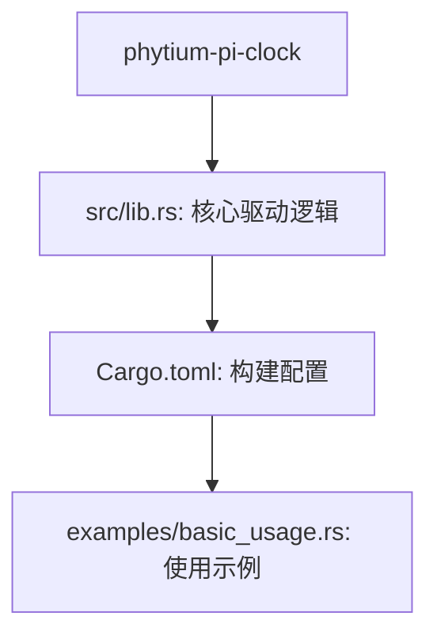
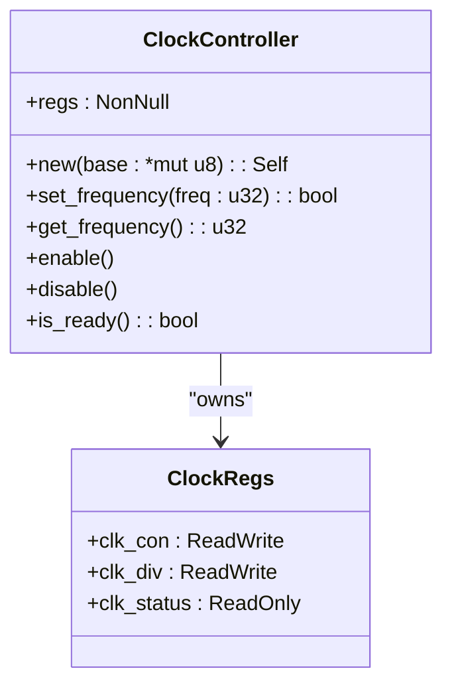

# `no_std`环境与嵌入式Rust开发

<cite>
**Referenced Files in This Document **   
- [lib.rs](file://src/lib.rs)
- [Cargo.toml](file://Cargo.toml)
- [basic_usage.rs](file://examples/basic_usage.rs)
</cite>

## 目录
1. [引言](#引言)
2. [项目结构](#项目结构)
3. [`no_std`的核心作用与意义](#no_std的核心作用与意义)
4. [`core` crate的实践应用](#core-crate的实践应用)
5. [`no_std`与`std`关键差异对比](#no_std与std关键差异对比)
6. [`ClockController`硬件抽象实现分析](#clockcontroller硬件抽象实现分析)
7. 常见编译错误及解决方案
8. 结论

## 引言
在嵌入式系统开发中，资源受限和确定性执行是核心要求。本项目作为飞腾派平台的时钟控制驱动，通过采用`#![no_std]`属性实现了对标准库的脱离，展示了现代嵌入式Rust开发的最佳实践。本文将深入分析`no_std`环境下的开发模式、内存管理策略以及硬件抽象层的设计原则。

## 项目结构
项目采用典型的嵌入式Rust驱动架构，包含核心库模块和使用示例：



**Diagram sources**
- [lib.rs](file://src/lib.rs#L0-L274)
- [Cargo.toml](file://Cargo.toml#L0-L40)

**Section sources**
- [lib.rs](file://src/lib.rs#L0-L274)
- [Cargo.toml](file://Cargo.toml#L0-L40)

## `no_std`的核心作用与意义

### 嵌入式驱动为何需要`no_std`
嵌入式硬件驱动必须脱离标准库运行，主要原因包括：
- **资源限制**：微控制器通常只有几KB到几十KB的RAM，无法承载标准库的庞大开销
- **确定性执行**：标准库中的动态内存分配可能导致不可预测的延迟，影响实时性能
- **硬件直接访问**：需要直接操作内存映射的寄存器，避免操作系统抽象层的干预
- **启动环境**：在操作系统初始化之前，驱动可能就需要工作

项目通过`#![no_std]`属性明确声明不依赖标准库，这使得代码可以直接在裸机环境中运行。

**Section sources**
- [lib.rs](file://src/lib.rs#L0-L1)

### `no_std`环境下的基础支持
在`no_std`环境下，虽然不能使用`std`，但Rust提供了`core`、`alloc`和`proc_macro`等最小化运行时组件：
- `core`：提供语言核心功能（如基本类型、切片、迭代器等）
- `alloc`：提供堆分配能力（可选启用）
- `panic_handler`：必须自定义恐慌处理程序

项目通过在示例代码中定义`#[panic_handler]`来满足这一要求。

**Section sources**
- [basic_usage.rs](file://examples/basic_usage.rs#L60-L64)

## `core` crate的实践应用

### 内存安全与指针操作
`core::ptr::NonNull`在本项目中用于安全地表示非空指针，避免了直接使用原始指针的风险：

```rust
pub struct ClockController {
    regs: NonNull<ClockRegs>,
}
```

`NonNull`确保了指针永远不会为空，同时保持了零成本抽象的特性，非常适合硬件寄存器访问场景。

**Section sources**
- [lib.rs](file://src/lib.rs#L55-L57)

### CPU效率优化
`core::hint::spin_loop`用于在等待硬件状态变化时提示CPU进行优化：

```rust
while self.regs().clk_status.read(CLK_STATUS::READY) != 1 && timeout < 500 {
    timeout += 1;
    for _ in 0..1000 {
        core::hint::spin_loop();
    }
}
```

该函数向CPU发出信号，表明当前处于忙等待循环中，允许处理器进行功耗优化或超线程调度。

**Section sources**
- [lib.rs](file://src/lib.rs#L149-L155)

## `no_std`与`std`关键差异对比

| 特性 | `std`环境 | `no_std`环境 | 说明 |
|------|----------|-------------|------|
| 启动依赖 | 完整C运行时 | 无外部依赖 | `no_std`可在裸机上直接运行 |
| 内存分配 | 自动堆管理 | 手动/静态分配 | 需要显式管理生命周期 |
| 错误处理 | panic unwind | panic abort | 通常禁用栈展开以节省空间 |
| I/O操作 | 文件、网络等 | 寄存器、外设 | 直接硬件交互 |
| 并发原语 | 线程、通道 | 自旋锁、中断 | 无操作系统调度支持 |
| 标准类型 | Vec, String, HashMap | ArrayVec, Str, BTreeMap | 替代的无堆数据结构 |

**Section sources**
- [lib.rs](file://src/lib.rs#L0-L274)
- [basic_usage.rs](file://examples/basic_usage.rs#L0-L64)

## `ClockController`硬件抽象实现分析

### 安全的硬件抽象设计
`ClockController`结构体通过以下方式实现了安全的硬件抽象：



**Diagram sources**
- [lib.rs](file://src/lib.rs#L55-L168)

**Section sources**
- [lib.rs](file://src/lib.rs#L55-L168)

#### 关键设计特点：
1. **内存安全**：使用`NonNull`确保寄存器指针永不为空
2. **线程安全**：通过`unsafe impl Send + Sync`声明跨线程可用性
3. **零成本抽象**：所有方法调用都在编译时内联，无运行时开销
4. **资源管理**：不持有任何需要析构的资源，符合`Copy`语义

### 全局状态管理
项目使用`Once<Mutex<ClockHandle>>`实现了一次性初始化的全局时钟管理：

```rust
static GLOBAL_CLOCK: Once<Mutex<ClockHandle>> = Once::new();
```

这种模式确保了：
- 初始化只发生一次
- 多线程访问的安全性
- 无需动态内存分配

**Section sources**
- [lib.rs](file://src/lib.rs#L168-L172)

## 常见编译错误及解决方案

### `alloc`依赖冲突
当尝试使用需要堆分配的功能时，可能出现链接错误。解决方案是在`Cargo.toml`中添加`alloc`特性并提供全局分配器：

```toml
[dependencies]
alloc = { version = "1.0", features = ["collections"] }
```

然后在代码中实现`GlobalAlloc` trait。

### 缺少`panic_handler`
忘记定义恐慌处理程序会导致链接错误。必须在二进制crate中定义：

```rust
#[panic_handler]
fn panic(_info: &core::panic::PanicInfo) -> ! {
    loop {}
}
```

### 标准库类型不可用
`Vec`、`String`等类型默认不可用。替代方案包括：
- 使用`heapless::Vec`或`arrayvec::ArrayVec`
- 使用`&str`代替`String`
- 使用`BTreeMap`等基于栈的数据结构

**Section sources**
- [basic_usage.rs](file://examples/basic_usage.rs#L60-L64)
- [Cargo.toml](file://Cargo.toml#L0-L40)