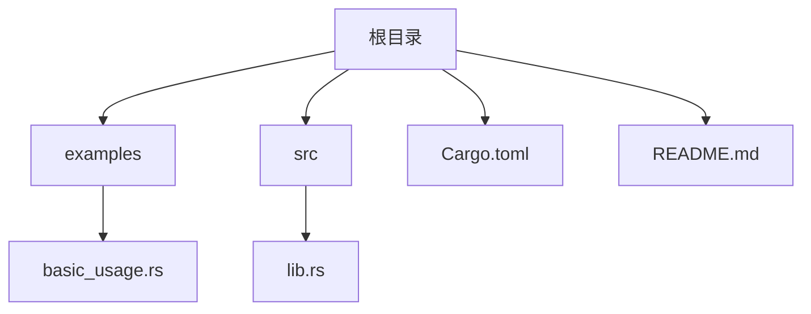
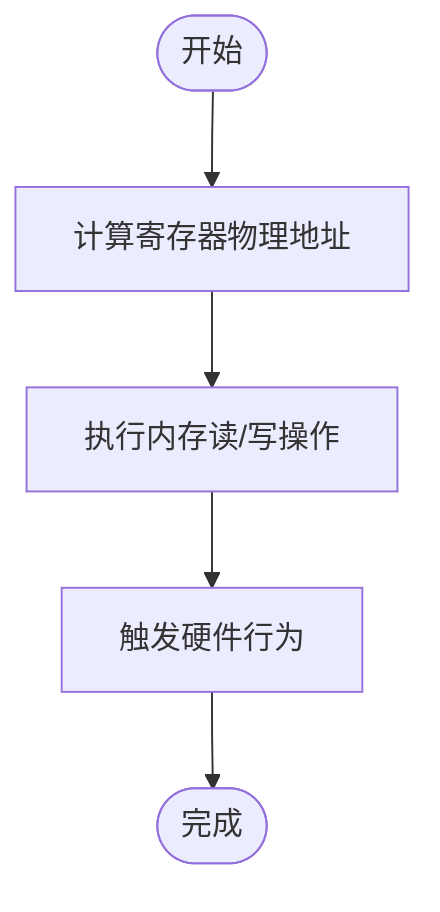
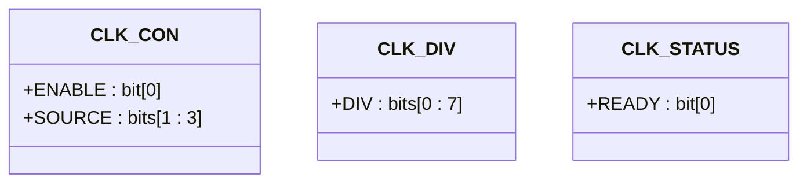
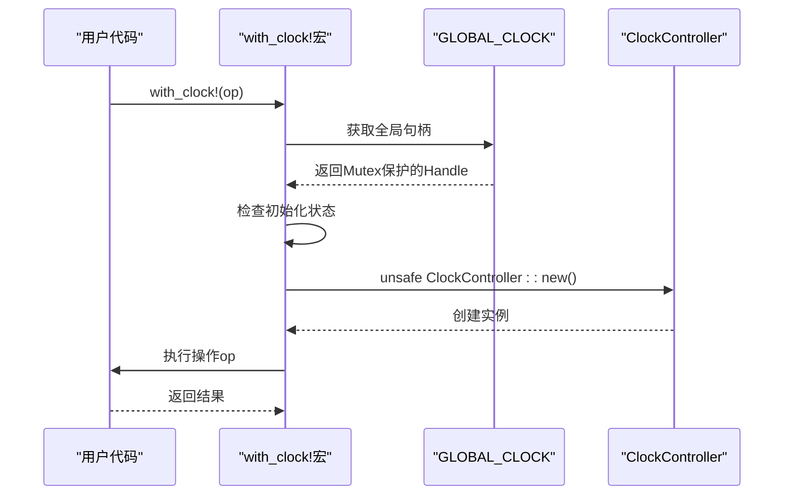

# 内存映射I/O与物理地址绑定

<cite>
**Referenced Files in This Document **  
- [lib.rs](file://src/lib.rs)
- [Cargo.toml](file://Cargo.toml)
- [README.md](file://README.md)
</cite>

## 目录
1. [引言](#引言)
2. [项目结构](#项目结构)
3. [核心组件](#核心组件)
4. [内存映射I/O机制分析](#内存映射io机制分析)
5. [寄存器布局与偏移定义](#寄存器布局与偏移定义)
6. [安全契约与指针管理](#安全契约与指针管理)
7. [宏展开与实例生命周期](#宏展开与实例生命周期)
8. [调试检查清单](#调试检查清单)
9. [结论](#结论)

## 引言
本文深入解析内存映射I/O（MMIO）机制在飞腾派时钟控制器中的应用。通过分析`ClockController`驱动的实现，详细说明CPU如何通过读写特定物理地址来控制硬件寄存器，并探讨相关安全性和可靠性保障机制。

## 项目结构
本项目采用标准Rust库结构，包含源码、示例和配置文件。



**Diagram sources**
- [Cargo.toml](file://Cargo.toml#L1-L40)
- [README.md](file://README.md#L1-L120)

**Section sources**
- [Cargo.toml](file://Cargo.toml#L1-L40)
- [README.md](file://README.md#L1-L120)

## 核心组件
本节分析时钟控制器的核心数据结构和功能模块。

**Section sources**
- [lib.rs](file://src/lib.rs#L1-L275)

## 内存映射I/O机制分析
内存映射I/O（MMIO）是嵌入式系统中CPU与外设通信的关键机制。在本驱动中，CPU通过直接访问物理地址空间来操作硬件寄存器。

### MMIO工作原理
当CPU需要与外设交互时：
1. 将外设寄存器映射到特定物理地址范围
2. CPU执行普通内存读写指令访问这些地址
3. 内存控制器将访问重定向到对应的硬件单元

在飞腾派平台中，时钟控制器基地址为`0x2800_0000`，该地址由SoC设计固定分配。

#### 寄存器访问流程


**Diagram sources**
- [lib.rs](file://src/lib.rs#L1-L275)

**Section sources**
- [lib.rs](file://src/lib.rs#L1-L275)

## 寄存器布局与偏移定义
`ClockRegs`结构体使用`register_structs!`宏定义了精确的寄存器布局。

### 寄存器映射表
| 偏移地址 | 寄存器名称 | 功能描述 |
|---------|----------|--------|
| 0x00 | clk_con | 时钟控制寄存器 |
| 0x04 | clk_div | 时钟分频寄存器 |
| 0x08 | clk_status | 时钟状态寄存器 |

### 位字段定义


**Diagram sources**
- [lib.rs](file://src/lib.rs#L15-L45)

**Section sources**
- [lib.rs](file://src/lib.rs#L15-L45)

## 安全契约与指针管理
`unsafe fn new(base: *mut u8)`方法体现了Rust中不安全代码的安全契约原则。

### 安全契约要求
调用者必须确保：
- 提供的`base`指针指向有效的物理地址
- 地址已正确映射到进程地址空间
- 没有其他并发访问冲突

### NonNull指针的作用
`NonNull<ClockRegs>`类型提供了关键安全保障：
- 确保指针非空，防止空指针解引用
- 实现`Send`和`Sync` trait，支持跨线程传递
- 与裸指针相比更安全，但仍需谨慎使用

```rust
// 安全转换示例
NonNull::new(base).unwrap().cast()
```

**Section sources**
- [lib.rs](file://src/lib.rs#L50-L60)

## 宏展开与实例生命周期
`with_clock!`宏简化了全局时钟实例的访问模式。

### 宏展开过程


**Diagram sources**
- [lib.rs](file://src/lib.rs#L200-L220)

**Section sources**
- [lib.rs](file://src/lib.rs#L200-L220)

### 生命周期管理
从`base_address`到`ClockController`实例的完整生命周期包括：
1. 通过`lookup_config()`获取配置
2. 调用`init_clock()`初始化全局状态
3. `with_clock!`宏内部创建临时`ClockController`
4. 执行指定操作后自动销毁实例

## 调试检查清单
当遇到MMIO访问失败时，请按以下清单逐一排查：

### 地址相关问题
- [ ] 确认物理地址`0x2800_0000`正确无误
- [ ] 检查地址对齐是否符合要求（通常需要4字节对齐）
- [ ] 验证内存映射是否已在启动阶段正确配置

### 缓存一致性
- [ ] 确保DMA或硬件修改后的数据能被CPU正确读取
- [ ] 必要时执行缓存刷新或无效化操作
- [ ] 考虑使用`volatile`访问保证内存顺序

### 硬件状态
- [ ] 检查电源和复位状态是否正常
- [ ] 确认时钟源已稳定输出
- [ ] 验证总线连接是否可靠

### 软件配置
- [ ] 确保`init_clock()`已成功调用
- [ ] 检查`is_ready`标志位的状态
- [ ] 验证分频系数在有效范围内（1-255）

**Section sources**
- [lib.rs](file://src/lib.rs#L1-L275)
- [README.md](file://README.md#L1-L120)

## 结论
本文详细分析了飞腾派时钟控制器中内存映射I/O的实现机制。通过`ClockController`驱动的设计，展示了如何安全有效地利用MMIO进行硬件控制。关键要点包括：
- 正确理解物理地址与寄存器的映射关系
- 严格遵守不安全函数的安全契约
- 合理使用`NonNull`等类型增强安全性
- 利用宏抽象复杂的状态管理逻辑
- 全面考虑调试和故障排查场景