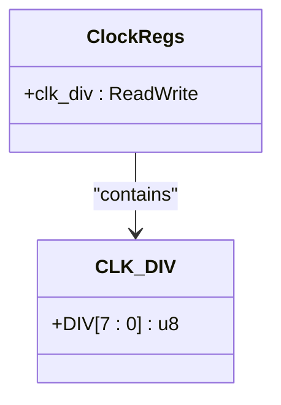
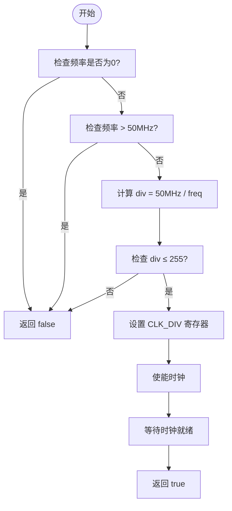
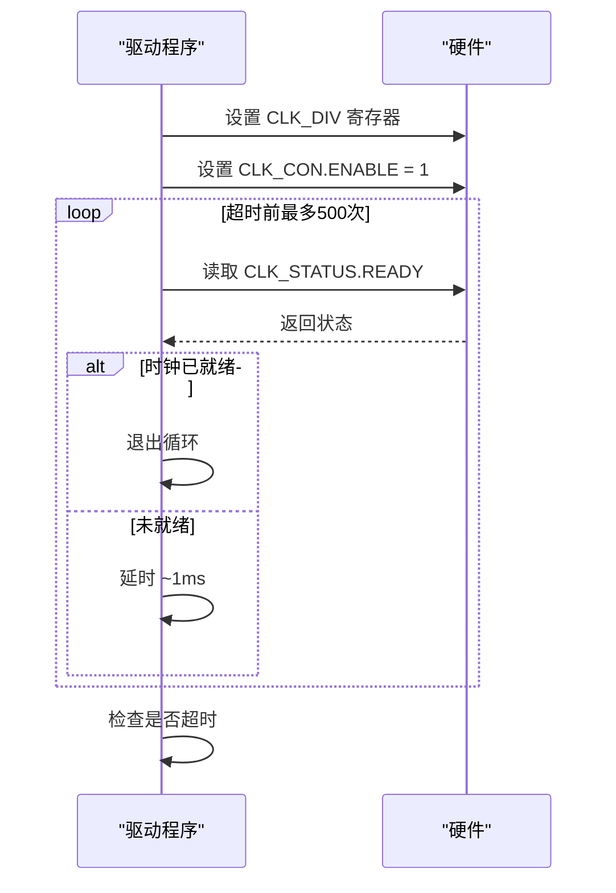

<cite>
**Referenced Files in This Document**  
- [lib.rs](file://src/lib.rs#L75-L81)
- [README.md](file://README.md#L45-L50)
</cite>

# 时钟分频原理与频率计算

## 目录
1. [引言](#引言)
2. [系统时钟基础](#系统时钟基础)
3. [分频寄存器结构](#分频寄存器结构)
4. [频率计算数学关系](#频率计算数学关系)
5. [边界条件与频率范围](#边界条件与频率范围)
6. [具体配置示例](#具体配置示例)
7. [时钟稳定性等待机制](#时钟稳定性等待机制)
8. [分频精度限制与影响](#分频精度限制与影响)

## 引言
本文档系统讲解飞腾派平台时钟驱动中的分频技术工作原理。基于`SYS_CLK_HZ = 50MHz`系统时钟源，详细分析8位分频系数寄存器`CLK_DIV`的实现机制，推导输出频率的数学关系，并说明相关控制逻辑。

## 系统时钟基础
本驱动基于固定的50MHz系统时钟源（`SYS_CLK_HZ = 50,000,000 Hz`）进行分频操作。该基准频率作为所有输出频率的计算基础，在代码中通过常量定义确保一致性。

**Section sources**
- [lib.rs](file://src/lib.rs#L75)

## 分频寄存器结构
`CLK_DIV`寄存器位于时钟控制器寄存器映射的0x04偏移处，其第0-7位（DIV[7:0]）用于存储8位无符号分频系数。该寄存器通过`tock-registers`库的安全抽象进行访问和修改。

**Diagram sources**
- [lib.rs](file://src/lib.rs#L12-L13)
- [lib.rs](file://src/lib.rs#L20-L22)

## 频率计算数学关系
分频器遵循基本的频率变换公式：`f_out = f_in / div`，其中：
- `f_in` 是输入频率（50MHz）
- `div` 是分频系数（1-255）
- `f_out` 是输出频率

当`div=1`时，输出频率等于输入频率（50MHz）；随着`div`值增大，输出频率按比例降低。

**Section sources**
- [lib.rs](file://src/lib.rs#L81)

## 边界条件与频率范围
`set_frequency()`方法实施了严格的边界检查，决定了可配置频率的有效范围：

- **最小分频系数**: 1 → 最大输出频率 = 50MHz / 1 = **50MHz**
- **最大分频系数**: 255 → 最小输出频率 = 50MHz / 255 ≈ **195.3kHz**

任何超出此范围的请求（如设置低于195.3kHz或高于50MHz的频率）都将被拒绝并返回错误。

**Diagram sources**
- [lib.rs](file://src/lib.rs#L77-L82)

## 具体配置示例
以设置25MHz输出频率为例，演示计算过程：

1. 输入目标频率：25,000,000 Hz
2. 计算分频系数：`div = 50,000,000 / 25,000,000 = 2`
3. 验证范围：`2 ≤ 255`，有效
4. 写入`CLK_DIV`寄存器：`DIV[7:0] = 0b00000010`

最终输出频率为50MHz ÷ 2 = 25MHz。

**Section sources**
- [lib.rs](file://src/lib.rs#L81)

## 时钟稳定性等待机制
在修改分频系数并使能时钟后，驱动会进入等待循环，通过查询`CLK_STATUS`寄存器的`READY`位来确认时钟已稳定。该机制包含500次尝试的超时保护，每次尝试间有约1000个CPU周期的延时，确保不会无限期阻塞。

**Diagram sources**
- [lib.rs](file://src/lib.rs#L90-L100)

## 分频精度限制与影响
由于分频系数必须为整数，输出频率存在固有的精度限制。例如，无法精确生成24MHz频率（需要`div=2.083`），实际只能选择`div=2`（25MHz）或`div=3`（16.67MHz）。这种离散性对定时器应用有显著影响：

- 定时精度受限于可用的时钟频率
- 高精度定时需求可能需要软件补偿
- 应用程序应查询实际获得的频率而非假设值

建议在关键定时应用中使用`get_frequency()`方法验证实际输出频率。

**Section sources**
- [lib.rs](file://src/lib.rs#L110-L116)