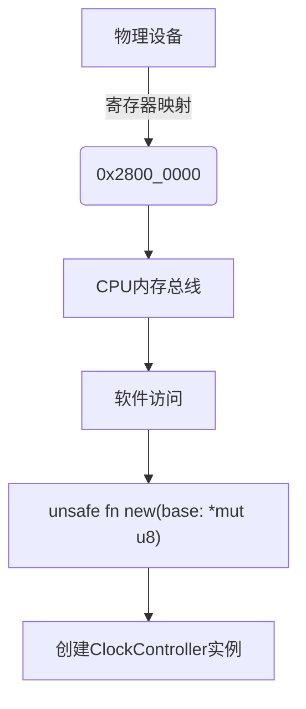
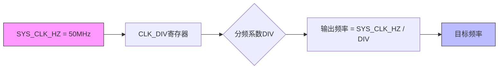

# 核心概念

<cite>
**Referenced Files in This Document **  
- [lib.rs](file://src/lib.rs)
- [Cargo.toml](file://Cargo.toml)
- [README.md](file://README.md)
- [basic_usage.rs](file://examples/basic_usage.rs)
</cite>

## Table of Contents
1. [no_std环境下的Rust驱动开发](#nostd环境下的rust驱动开发)
2. [内存映射I/O与物理地址绑定](#内存映射io与物理地址绑定)
3. [时钟分频机制与频率计算](#时钟分频机制与频率计算)
4. [线程安全的全局单例设计](#线程安全的全局单例设计)
5. [RAII模式在资源管理中的应用](#raii模式在资源管理中的应用)

## no_std环境下的Rust驱动开发

`#![no_std]`属性是嵌入式Rust开发的核心特征，它指示编译器不链接标准库`std`，而是使用精简的`core`库。这种设计对于硬件驱动具有重要意义：

- **资源受限环境适应性**：嵌入式系统通常内存有限，`no_std`消除了堆分配、文件系统等重量级组件，使代码能在裸机环境中运行
- **确定性行为保证**：避免了标准库中可能引入的非确定性操作（如动态内存分配），确保驱动程序的行为可预测
- **零成本抽象实现**：利用`core`库提供的基础类型和trait，结合Rust的零成本抽象特性，在保持高性能的同时提供高级语言特性

本驱动通过依赖`tock-registers`和`spin`等专为`no_std`设计的crate，实现了寄存器操作和同步原语，完美适配无操作系统环境。

**Section sources**
- [lib.rs](file://src/lib.rs#L1-L10)
- [Cargo.toml](file://Cargo.toml#L25-L30)

## 内存映射I/O与物理地址绑定

内存映射I/O（Memory-Mapped I/O）是处理器与外设通信的基础机制。在这种模式下，硬件寄存器被映射到特定的物理内存地址空间，CPU通过读写这些地址来控制外设。

### 为什么需要`unsafe fn new(base: *mut u8)`？



该方法的设计原因如下：
- **直接硬件访问**：`*mut u8`指针允许直接操作物理地址，绕过虚拟内存管理
- **安全性契约**：`unsafe`关键字明确告知调用者必须保证传入的地址有效且未被其他设备占用
- **灵活性**：支持不同平台的基地址配置，提高驱动的可移植性

实际使用中，飞腾派平台的时钟控制器基地址固定为`0x2800_0000`，通过`NonNull`智能指针确保地址非空并提供安全的引用转换。

**Diagram sources **
- [lib.rs](file://src/lib.rs#L45-L60)
- [README.md](file://README.md#L75-L80)

**Section sources**
- [lib.rs](file://src/lib.rs#L45-L60)
- [README.md](file://README.md#L75-L80)

## 时钟分频机制与频率计算

时钟分频是数字系统中调节信号频率的关键技术。本驱动基于50MHz系统时钟，通过`CLK_DIV`寄存器实现灵活的频率输出。

### 频率计算逻辑



具体实现细节：
- **分频范围限制**：`DIV`字段为8位，支持1-255的分频系数
- **边界条件处理**：当目标频率为0或超过50MHz时返回错误
- **实时性保障**：设置分频后等待`READY`标志位确认时钟稳定

例如，要获得25MHz输出频率，计算过程为：`50,000,000 / 2 = 25,000,000`，因此将`CLK_DIV::DIV`设置为2。

**Diagram sources **
- [lib.rs](file://src/lib.rs#L10-L15)
- [lib.rs](file://src/lib.rs#L130-L150)

**Section sources**
- [lib.rs](file://src/lib.rs#L130-L150)
- [README.md](file://README.md#L70-L75)

## 线程安全的全局单例设计

为确保多线程环境下时钟资源的安全访问，驱动采用双重保护机制：

### 设计原理

```mermaid
classDiagram
class Once {
+call_once(init_fn) Result<T, &str>
-state : InitState
}
class Mutex {
+lock() Guard<T>
-locked : bool
}
class ClockHandle {
+config : ClockConfig
+is_ready : u32
}
Once "1" --> "1" Mutex : 初始化
Mutex "1" --> "1" ClockHandle : 包装
note right of Once
保证全局初始化
的原子性和唯一性
end note
note right of Mutex
确保并发访问
的数据一致性
end note
```

#### `spin::Once`的作用
- **一次性初始化**：`GLOBAL_CLOCK`静态变量确保整个系统生命周期内只进行一次时钟初始化
- **原子性保证**：内部状态机防止竞态条件，即使多个线程同时调用`init_clock`也能正确处理

#### `Mutex`的必要性
- **临界区保护**：每次API调用都需要获取锁，防止并发修改配置
- **内存可见性**：确保一个线程的修改对其他线程立即可见

这种组合既满足了单例模式的要求，又提供了细粒度的并发控制。

**Diagram sources **
- [lib.rs](file://src/lib.rs#L220-L240)
- [lib.rs](file://src/lib.rs#L200-L210)

**Section sources**
- [lib.rs](file://src/lib.rs#L200-L240)
- [basic_usage.rs](file://examples/basic_usage.rs#L10-L15)

## RAII模式在资源管理中的应用

RAII（Resource Acquisition Is Initialization）是Rust所有权系统的核心体现。虽然本驱动未显式展示复杂的资源清理，但其设计理念充分体现了RAII原则：

- **构造即可用**：`ClockController::new`返回的实例立即处于可操作状态
- **作用域自动管理**：临时创建的控制器实例在其作用域结束时自动释放
- **借用检查保障**：编译器确保不会出现悬垂指针或重复释放

特别地，`with_clock!`宏封装了从全局单例获取锁到执行操作的完整流程，形成"获取-使用-释放"的自动化模式，这正是RAII思想在高层API中的体现。

**Section sources**
- [lib.rs](file://src/lib.rs#L250-L270)
- [lib.rs](file://src/lib.rs#L220-L240)