<cite>
**本文档引用的文件**
- [lib.rs](file://src/lib.rs)
- [Cargo.toml](file://Cargo.toml)
</cite>

# 线程安全与全局状态管理

## 目录
1. [引言](#引言)
2. [核心线程安全机制](#核心线程安全机制)
3. [初始化过程分析](#初始化过程分析)
4. [宏的锁获取流程](#宏的锁获取流程)
5. [no_std环境下的互斥锁选择](#no_std环境下的互斥锁选择)
6. [多核场景下的缓存一致性](#多核场景下的缓存一致性)
7. [优化建议](#优化建议)
8. [结论](#结论)

## 引言

在嵌入式系统和操作系统驱动开发中，全局状态的线程安全管理至关重要。本文档深入剖析`phytium-pi-clock`驱动中的线程安全设计，重点分析`static GLOBAL_CLOCK: Once<Mutex<ClockHandle>>`这一关键结构如何确保在并发环境下的正确性和可靠性。

## 核心线程安全机制

该驱动通过组合使用`Once`和`Mutex`两种同步原语，构建了一个既保证单次初始化又支持并发访问的安全机制。


**Diagram sources**
- [lib.rs](file://src/lib.rs#L168)

**Section sources**
- [lib.rs](file://src/lib.rs#L168-L168)

### Once的单次初始化保障

`Once`类型确保`init_clock()`函数在整个程序生命周期内仅执行一次。这种"一次性初始化"模式是解决静态变量竞争条件的经典方案。当多个线程同时尝试初始化全局时钟时，`Once::call_once`会保证只有一个线程能够成功执行初始化代码，其他线程将阻塞等待直到初始化完成。

### Mutex的并发访问控制

`Mutex`（互斥锁）为`ClockHandle`提供了运行时的并发访问控制。每次对全局时钟的操作都需要先获取锁，这防止了多个线程同时修改时钟配置或状态，避免了竞态条件的发生。

## 初始化过程分析

```mermaid
sequenceDiagram
participant ThreadA as "线程 A"
participant ThreadB as "线程 B"
participant Once as "Once<Mutex<ClockHandle>>"
participant Init as "init_clock()"
ThreadA->>Init : 调用 init_clock()
Init->>Once : call_once(|| Mutex : : new(...))
Note over Once : 第一次调用，执行初始化
Once-->>Init : 返回 Mutex 实例
Init->>Init : 获取锁并设置配置
Init-->>ThreadA : 返回 Ok(())
ThreadB->>Init : 调用 init_clock()
Init->>Once : call_once(|| ...)
Note over Once : 非首次调用，直接返回
Once-->>Init : 返回已存在的 Mutex
Init->>Init : 获取锁检查 is_ready
Init-->>ThreadB : 返回 Err("already initialized")
```



**Diagram sources**
- [lib.rs](file://src/lib.rs#L174-L190)

**Section sources**
- [lib.rs](file://src/lib.rs#L174-L190)

`init_clock()`函数首先调用`GLOBAL_CLOCK.call_once(|| Mutex::new(ClockHandle::new()))`。`call_once`确保内部闭包只执行一次，创建并初始化`Mutex<ClockHandle>`实例。随后，函数获取锁并检查`is_ready`标志位，防止重复初始化。

## 宏的锁获取流程


**Diagram sources**
- [lib.rs](file://src/lib.rs#L213-L235)

**Section sources**
- [lib.rs](file://src/lib.rs#L213-L235)

### RAII异常安全保证

`with_clock!`宏中`let handle = global_clock.lock();`体现了RAII（Resource Acquisition Is Initialization）原则。`MutexGuard`的析构函数会在其作用域结束时自动释放锁，即使操作过程中发生panic，也能保证锁被正确释放，防止死锁。

## no_std环境下的互斥锁选择

### spin::Mutex的适用性

在`no_std`环境下，传统的基于操作系统的互斥锁（如`std::sync::Mutex`）不可用，因为它们依赖于操作系统提供的线程调度和阻塞机制。`spin::Mutex`是一个自旋锁实现，适用于以下场景：

- **无操作系统环境**：不依赖OS原语，可在bare-metal环境中使用
- **短临界区**：时钟操作通常很快，适合自旋等待
- **实时性要求高**：避免上下文切换开销

### 忙等待特性的影响


**Diagram sources**
- [lib.rs](file://src/lib.rs#L9)
- [Cargo.toml](file://Cargo.toml#L25)

**Section sources**
- [lib.rs](file://src/lib.rs#L9)

`spin::Mutex`采用忙等待（busy-waiting）策略，当一个线程无法获取锁时，它不会让出CPU，而是持续检查锁的状态。这种策略的优点是避免了上下文切换的开销，但在多核系统中可能导致：
- CPU资源浪费
- 能源效率低下
- 在长临界区情况下性能下降

## 多核场景下的缓存一致性

在多核处理器系统中，每个核心都有自己的缓存。当一个核心修改了`ClockHandle`的状态后，其他核心的缓存可能仍然持有旧值，导致缓存一致性问题。

### 潜在问题

1. **写后读不一致**：核心A更新了时钟频率，核心B读取时仍看到旧值
2. **内存重排序**：编译器或CPU可能重排序内存访问，破坏预期的执行顺序
3. **虚假共享**：不同核心频繁访问同一缓存行的不同部分，导致缓存行在核心间频繁迁移

## 优化建议

### 内存屏障的使用

为了确保跨核心的内存可见性和顺序性，建议在关键位置插入内存屏障：

```rust
use core::sync::atomic::{compiler_fence, Ordering};

// 在修改共享状态后插入编译器屏障
handle.config = config;
compiler_fence(Ordering::Release);
handle.is_ready = 0x11111111u32;

// 在读取共享状态前插入编译器屏障
if compiler_fence(Ordering::Acquire); 
    handle.is_ready == 0x11111111u32 {
    // 安全地使用配置
}
```

### 原子操作替代

对于简单的状态标志，可以考虑使用原子类型替代整个结构体的锁定：

```rust
use core::sync::atomic::{AtomicU32, Ordering};

static CLOCK_READY: AtomicU32 = AtomicU32::new(0);

// 设置就绪状态
CLOCK_READY.store(0x11111111, Ordering::Release);

// 检查就绪状态
if CLOCK_READY.load(Ordering::Acquire) == 0x11111111 {
    // 执行操作
}
```

### 缓存行对齐

为了避免虚假共享，可以将频繁访问的数据结构对齐到缓存行边界：

```rust
#[repr(align(64))] // 假设缓存行大小为64字节
struct CacheAlignedClockHandle {
    config: ClockConfig,
    _padding: [u8; 64 - core::mem::size_of::<ClockConfig>()],
    is_ready: u32,
}
```

## 结论

`phytium-pi-clock`驱动通过精心设计的`Once<Mutex<T>>`模式，有效地解决了全局时钟实例的线程安全问题。`Once`确保了单次初始化的原子性，而`Mutex`提供了运行时的并发访问控制。`with_clock!`宏利用RAII原则保证了异常安全的锁管理。

尽管当前实现已经具备良好的线程安全性，但在多核实时系统中，仍可通过引入内存屏障、原子操作和缓存行对齐等技术进一步优化性能和可靠性。这些改进将有助于提升驱动在复杂多核环境下的表现，满足更高标准的实时性和确定性要求。