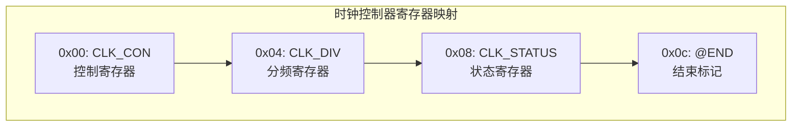
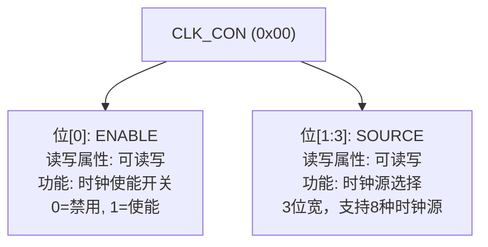
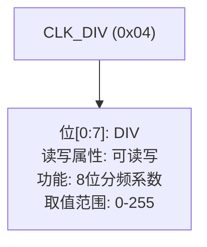
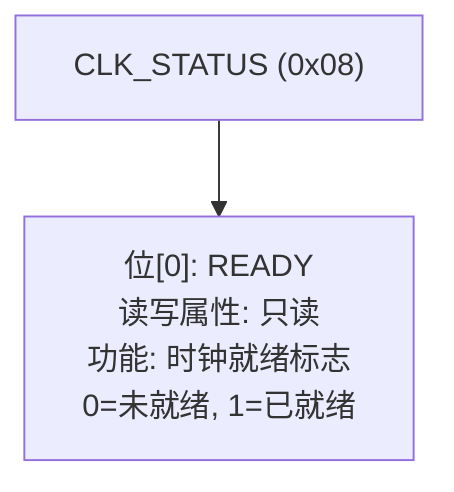

# 寄存器布局

<cite>
**Referenced Files in This Document **  
- [src/lib.rs](file://src/lib.rs)
</cite>

## 目录
1. [寄存器内存映射结构](#寄存器内存映射结构)
2. [核心寄存器位域定义](#核心寄存器位域定义)
3. [寄存器访问机制](#寄存器访问机制)

## 寄存器内存映射结构

飞腾派时钟控制器的寄存器采用内存映射I/O方式组织，通过`register_structs!`宏在源码中定义了连续的寄存器布局。该布局从基地址开始，按4字节对齐排列三个核心寄存器，形成一个紧凑的寄存器块。

**Diagram sources**
- [src/lib.rs](file://src/lib.rs#L9-L16)

**Section sources**
- [src/lib.rs](file://src/lib.rs#L9-L16)

## 核心寄存器位域定义

### 寄存器概览表

| 寄存器名称 | 偏移地址 | 类型 | 功能描述 |
|----------|---------|------|---------|
| `CLK_CON` | 0x00 | ReadWrite<u32> | 时钟控制寄存器，用于使能/禁用时钟和选择时钟源 |
| `CLK_DIV` | 0x04 | ReadWrite<u32> | 时钟分频寄存器，设置分频系数 |
| `CLK_STATUS` | 0x08 | ReadOnly<u32> | 时钟状态寄存器，反映当前时钟就绪状态 |

### 详细位域结构

#### CLK_CON (控制寄存器)
此寄存器为可读写类型，用于配置时钟的基本操作参数。

**Diagram sources**
- [src/lib.rs](file://src/lib.rs#L18-L22)

#### CLK_DIV (分频寄存器)
此寄存器为可读写类型，用于设置时钟分频系数。

**Diagram sources**
- [src/lib.rs](file://src/lib.rs#L23-L25)

#### CLK_STATUS (状态寄存器)
此寄存器为只读类型，用于查询时钟模块的当前状态。

**Diagram sources**
- [src/lib.rs](file://src/lib.rs#L26-L28)

**Section sources**
- [src/lib.rs](file://src/lib.rs#L18-L28)

## 寄存器访问机制

时钟控制器通过`ClockController`结构体提供安全的寄存器访问接口。该结构体使用`NonNull<ClockRegs>`存储寄存器基地址，并通过两个关键方法实现类型安全的寄存器访问：

- `regs()` 方法：返回指向`ClockRegs`的不可变引用，用于读取寄存器值
- `regs_mut()` 方法：返回指向`ClockRegs`的可变引用，用于修改寄存器值

这些方法与`tock-registers`库集成，实现了类型安全的寄存器抽象。所有寄存器操作都通过字段级别的`modify`、`read`等方法进行，避免了直接的位操作错误。

当修改`CLK_CON`或`CLK_DIV`寄存器后，硬件需要一定时间重新配置时钟信号。此时必须轮询`CLK_STATUS.READY`位，直到其被置位（值为1），表示新的时钟配置已经生效。这种"写入-等待就绪"的机制确保了时钟切换的稳定性。

**Section sources**
- [src/lib.rs](file://src/lib.rs#L38-L150)