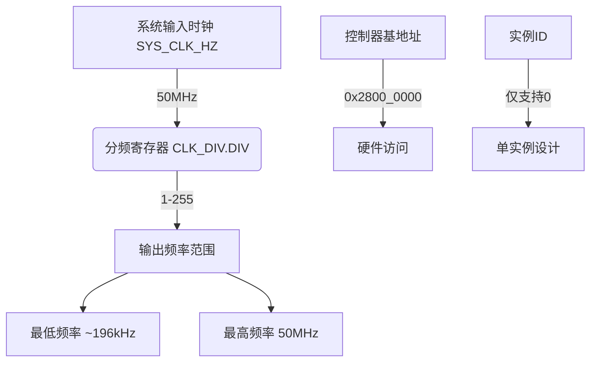

# 时钟参数

<cite>
**Referenced Files in This Document **   
- [lib.rs](file://src/lib.rs)
- [Cargo.toml](file://Cargo.toml)
- [README.md](file://README.md)
</cite>

## 目录
1. [引言](#引言)
2. [核心硬件时钟参数](#核心硬件时钟参数)
3. [系统输入时钟频率](#系统输入时钟频率)
4. [控制器基地址](#控制器基地址)
5. [分频寄存器与可配置频率范围](#分频寄存器与可配置频率范围)
6. [分频系数的特殊处理](#分频系数的特殊处理)
7. [实例ID限制与单实例设计](#实例id限制与单实例设计)
8. [参数对初始化和高层接口的影响](#参数对初始化和高层接口的影响)

## 引言
本文档系统化整理了飞腾派平台时钟驱动所依赖的关键硬件参数。这些参数是正确使用该驱动的基础，直接影响 `ClockConfig` 的初始化以及 `api::set_frequency` 等高层接口的行为边界。文档将从源码中提取并确认各项关键参数，并详细说明其实际影响。

## 核心硬件时钟参数
本节概述了驱动中定义的核心硬件时钟参数，这些参数共同决定了时钟模块的功能和性能边界。

**Diagram sources **
- [lib.rs](file://src/lib.rs#L60-L61)
- [lib.rs](file://src/lib.rs#L140-L142)
- [lib.rs](file://src/lib.rs#L240-L245)

## 系统输入时钟频率
系统输入时钟频率是整个时钟模块的基准。在驱动代码中，此频率被明确定义为常量 `SYS_CLK_HZ`。

在 `ClockController` 结构体的 `set_frequency` 和 `get_frequency` 方法中，均定义了 `const SYS_CLK_HZ: u32 = 50_000_000;`，这表明系统的主时钟频率为 **50MHz**。所有后续的频率计算都以此为基础进行。

**Section sources**
- [lib.rs](file://src/lib.rs#L60-L61)
- [lib.rs](file://src/lib.rs#L140-L142)

## 控制器基地址
控制器基地址是CPU访问时钟硬件寄存器的内存映射入口点。

在 `lookup_config` 函数中，基地址被硬编码为 `0x2800_0000usize`。这意味着时钟控制器的寄存器组从物理地址 `0x2800_0000` 开始映射。任何直接或间接（通过全局句柄）访问硬件的操作都必须使用此地址。

**Section sources**
- [lib.rs](file://src/lib.rs#L240-L245)

## 分频寄存器与可配置频率范围
分频寄存器 `CLK_DIV.DIV` 是控制输出频率的核心。

根据寄存器位域定义 `register_bitfields![u32, CLK_DIV [ DIV OFFSET(0) NUMBITS(8) [], ]];`，`DIV` 字段是一个8位无符号整数，因此其有效取值范围为 **1 到 255**。

由此可以计算出可配置的输出频率范围：
- **最高频率**：当分频系数为1时，输出频率等于输入频率，即 **50MHz**。
- **最低频率**：当分频系数为最大值255时，输出频率为 50,000,000 / 255 ≈ **196,078 Hz (约196kHz)**。

因此，该驱动支持的可配置输出频率范围为 **196kHz 至 50MHz**。

**Section sources**
- [lib.rs](file://src/lib.rs#L14-L15)
- [lib.rs](file://src/lib.rs#L140-L142)

## 分频系数的特殊处理
驱动代码对分频系数为0的情况进行了特殊处理。

在 `get_frequency` 方法中，有如下逻辑：`if div == 0 { SYS_CLK_HZ } else { SYS_CLK_HZ / div }`。这表明，当读取到的分频系数为0时，驱动会将其视为不分频状态，并返回全速的50MHz。这种设计通常是为了兼容硬件的默认状态或提供一个“关闭分频”的选项。

同时，在 `set_frequency` 方法中，对分频系数的最大值（255）进行了检查，这直接决定了系统能够达到的最低可用频率。

**Section sources**
- [lib.rs](file://src/lib.rs#L140-L142)
- [lib.rs](file://src/lib.rs#L60-L61)

## 实例ID限制与单实例设计
驱动目前的设计是单实例的。

`lookup_config` 函数明确地判断 `if instance_id >= 1 { return None; }`，这表明系统目前仅支持 `instance_id` 为 `0` 的单一实例。任何大于等于1的实例ID请求都将被拒绝。这一设计简化了全局状态管理，但也意味着该驱动在同一时间只能管理一个时钟控制器。

**Section sources**
- [lib.rs](file://src/lib.rs#L240-L245)

## 参数对初始化和高层接口的影响
上述所有参数对于正确初始化 `ClockConfig` 和调用 `init_clock` 至关重要。

用户必须使用 `lookup_config(0)` 获取正确的配置（包含基地址），然后才能成功调用 `init_clock` 来初始化全局时钟句柄。一旦初始化完成，高层API（如 `api::set_frequency`）的行为就完全受限于这些底层参数。例如，向 `api::set_frequency` 传递一个会导致分频系数超过255的低频率值（如低于196kHz），该调用将失败并返回 `false`。理解这些参数是确保驱动稳定、可靠运行的前提。

**Section sources**
- [lib.rs](file://src/lib.rs#L240-L245)
- [lib.rs](file://src/lib.rs#L130-L135)
- [lib.rs](file://src/lib.rs#L250-L255)