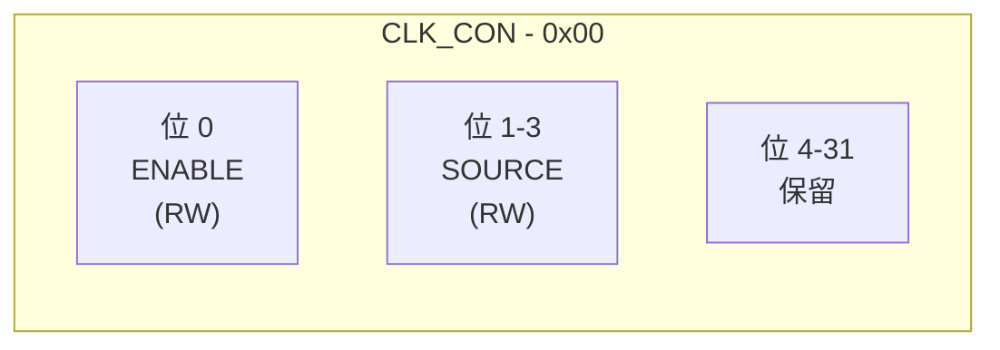
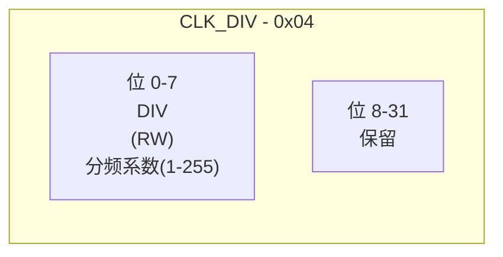
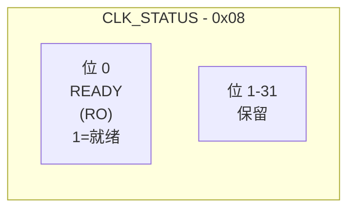

# 硬件规格

<cite>
**本文档引用的文件**
- [lib.rs](file://src/lib.rs)
- [Cargo.toml](file://Cargo.toml)
- [README.md](file://README.md)
</cite>

## 目录
1. [引言](#引言)
2. [核心硬件参数](#核心硬件参数)
3. [寄存器布局与功能](#寄存器布局与功能)
4. [寄存器映射表](#寄存器映射表)
5. [位域结构图](#位域结构图)
6. [时序与操作要求](#时序与操作要求)

## 引言

本文档旨在系统化地整理和呈现飞腾派平台时钟控制器的硬件规格信息。通过对驱动源码和项目文档的深入分析，本文档明确了时钟控制器的关键物理参数、寄存器级接口定义以及操作时序要求。这些信息是理解驱动行为、进行硬件兼容性调试和开发上层应用的基础。

**Section sources**
- [lib.rs](file://src/lib.rs#L1-L50)
- [README.md](file://README.md#L1-L20)

## 核心硬件参数

根据对 `lib.rs` 和 `README.md` 文件的分析，飞腾派平台时钟控制器的核心硬件参数如下：

- **基地址 (Base Address)**: `0x2800_0000`
  - 这是时钟控制器在内存映射中的起始地址，所有寄存器都相对于此地址进行访问。
- **系统输入时钟频率 (System Input Clock Frequency)**: `50MHz`
  - 驱动代码中明确定义了常量 `SYS_CLK_HZ` 为 `50,000,000` Hz，这是分频计算的基准频率。
- **分频寄存器有效范围**: `1-255`
  - 分频系数由一个8位字段（`DIV`）控制，其值范围为1到255。值为0时被视为无效或特殊状态。
- **输出频率区间**: `196kHz ~ 50MHz`
  - 最低输出频率：当分频系数为最大值255时，`50MHz / 255 ≈ 196.08kHz`。
  - 最高输出频率：当分频系数为最小值1时，输出频率等于输入频率 `50MHz`。

**Section sources**
- [lib.rs](file://src/lib.rs#L75-L76)
- [lib.rs](file://src/lib.rs#L110-L111)
- [lib.rs](file://src/lib.rs#L209-L211)
- [README.md](file://README.md#L100-L103)

## 寄存器布局与功能

时钟控制器通过一组内存映射寄存器（MMIO）进行配置和状态查询。其布局在 `ClockRegs` 结构体中定义，各寄存器的功能与时序要求如下：

### CLK_CON (时钟控制寄存器)
- **偏移地址**: `0x00`
- **功能**: 控制时钟模块的基本开关和模式。
- **关键位域**:
  - `ENABLE` (位0): 写入 `1` 以使能时钟输出，写入 `0` 以禁用。
  - `SOURCE` (位1-3): 用于选择时钟源，当前实现中可能有默认或固定设置。
- **读写属性**: 可读可写 (ReadWrite)。
- **生效条件**: 修改后立即生效，但实际时钟信号的变化需要等待 `CLK_STATUS.READY` 置位。

### CLK_DIV (时钟分频寄存器)
- **偏移地址**: `0x04`
- **功能**: 设置时钟分频系数。
- **关键位域**:
  - `DIV` (位0-7): 8位无符号整数，表示分频比。有效值范围为 `1-255`。
- **读写属性**: 可读可写 (ReadWrite)。
- **生效条件**: 写入新值后，必须等待 `CLK_STATUS.READY` 置位，才能确认分频已稳定。

### CLK_STATUS (时钟状态寄存器)
- **偏移地址**: `0x08`
- **功能**: 反映时钟模块的内部状态。
- **关键位域**:
  - `READY` (位0): 只读位。`1` 表示时钟已稳定并准备好；`0` 表示时钟正在调整或未就绪。
- **读写属性**: 只读 (ReadOnly)。
- **使用要求**: 在修改 `CLK_CON` 或 `CLK_DIV` 后，必须轮询此位直到其变为 `1`，才能认为操作完成。

**Section sources**
- [lib.rs](file://src/lib.rs#L10-L35)

## 寄存器映射表

下表总结了时钟控制器的寄存器布局：

| 偏移地址 | 寄存器名称 | 类型 | 描述 |
| :--- | :--- | :--- | :--- |
| `0x00` | `CLK_CON` | ReadWrite | 时钟控制寄存器，包含使能和时钟源选择位。 |
| `0x04` | `CLK_DIV` | ReadWrite | 时钟分频寄存器，8位分频系数（1-255）。 |
| `0x08` | `CLK_STATUS` | ReadOnly | 时钟状态寄存器，提供 `READY` 就绪标志。 |

**Diagram sources**
- [lib.rs](file://src/lib.rs#L10-L18)

```mermaid
erDiagram
CLOCK_CONTROLLER {
string "0x00" PK
string "0x04"
string "0x08"
}
CLOCK_CONTROLLER ||--o{ CLK_CON : "offset 0x00"
CLOCK_CONTROLLER ||--o{ CLK_DIV : "offset 0x04"
CLOCK_CONTROLLER ||--o{ CLK_STATUS : "offset 0x08"
class CLK_CON {
bit ENABLE
bits[3] SOURCE
}
class CLK_DIV {
bits[8] DIV
}
class CLK_STATUS {
bit READY
}
```

## 位域结构图

以下图表详细展示了每个寄存器的位域分布。

### CLK_CON 寄存器 (0x00)


### CLK_DIV 寄存器 (0x04)


### CLK_STATUS 寄存器 (0x08)


**Diagram sources**
- [lib.rs](file://src/lib.rs#L20-L35)

## 时序与操作要求

对时钟控制器的任何配置更改都必须遵循严格的时序流程，以确保硬件状态的稳定性和一致性。

1.  **写入配置**: 首先向 `CLK_DIV` 和/或 `CLK_CON` 寄存器写入新的配置值。
2.  **等待就绪**: 立即开始轮询 `CLK_STATUS` 寄存器的 `READY` 位。
3.  **超时处理**: 驱动代码中实现了500次循环的超时机制，每次循环内包含延时，以防止无限等待。
4.  **操作完成**: 当 `READY` 位被置为 `1`，或达到超时限制时，操作结束。成功返回 `true`，超时则返回 `false`。

此流程在 `set_frequency` 方法中有明确体现，是安全操作硬件的必要步骤。

**Section sources**
- [lib.rs](file://src/lib.rs#L85-L105)