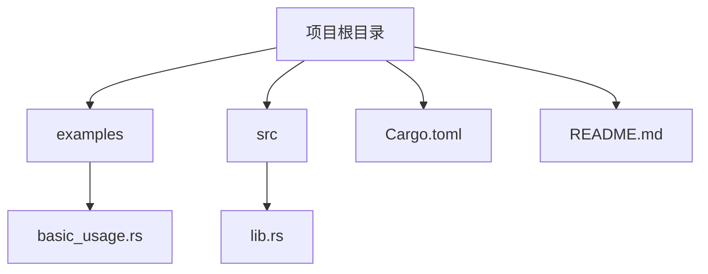
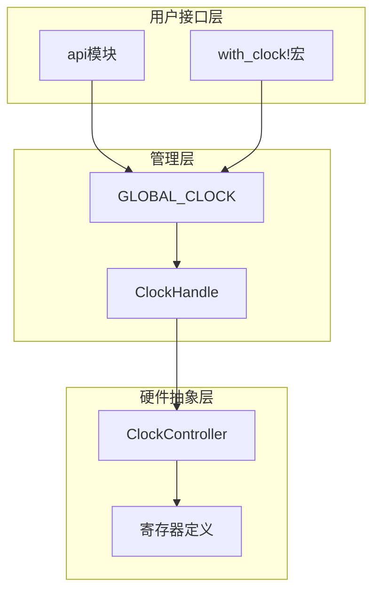
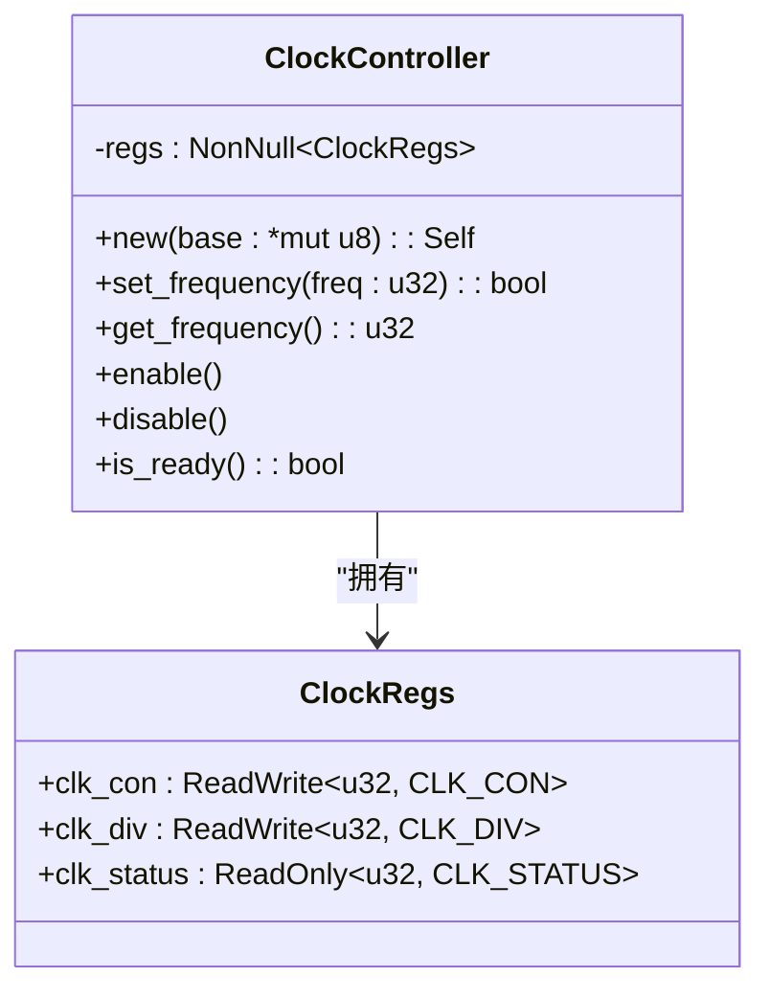
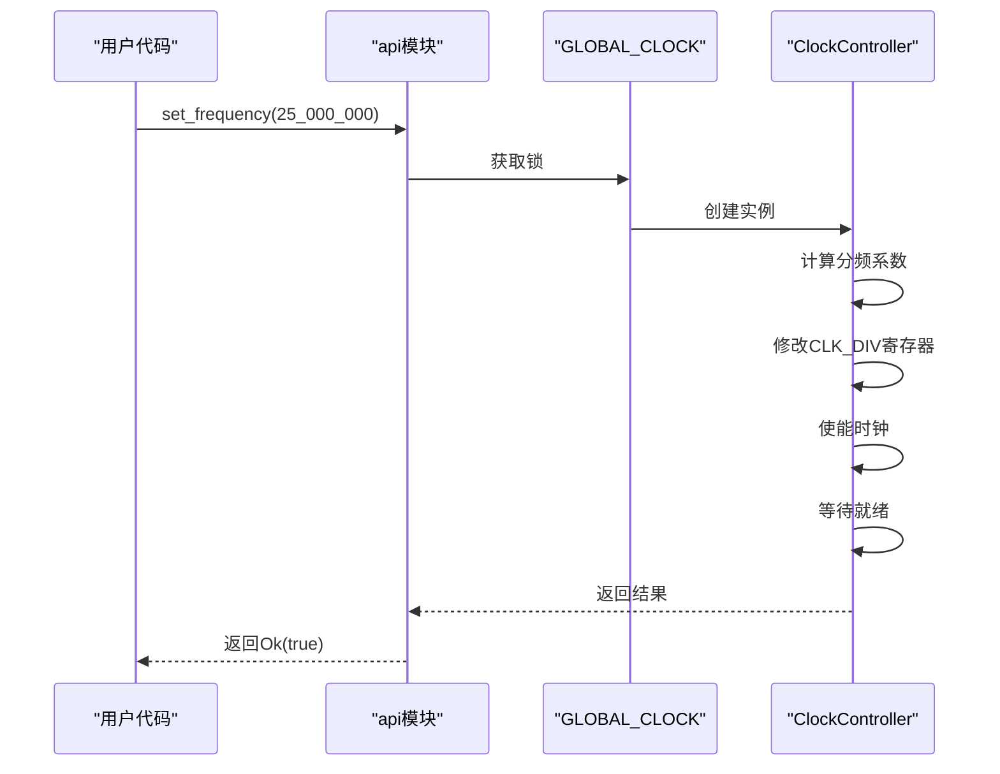
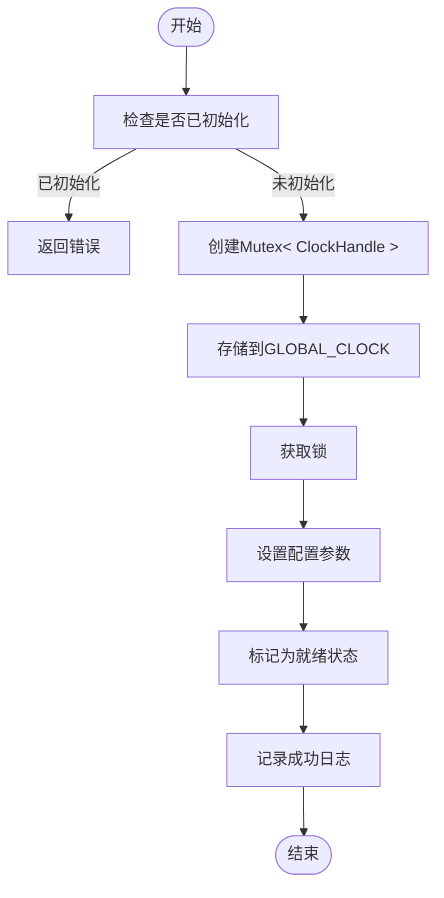
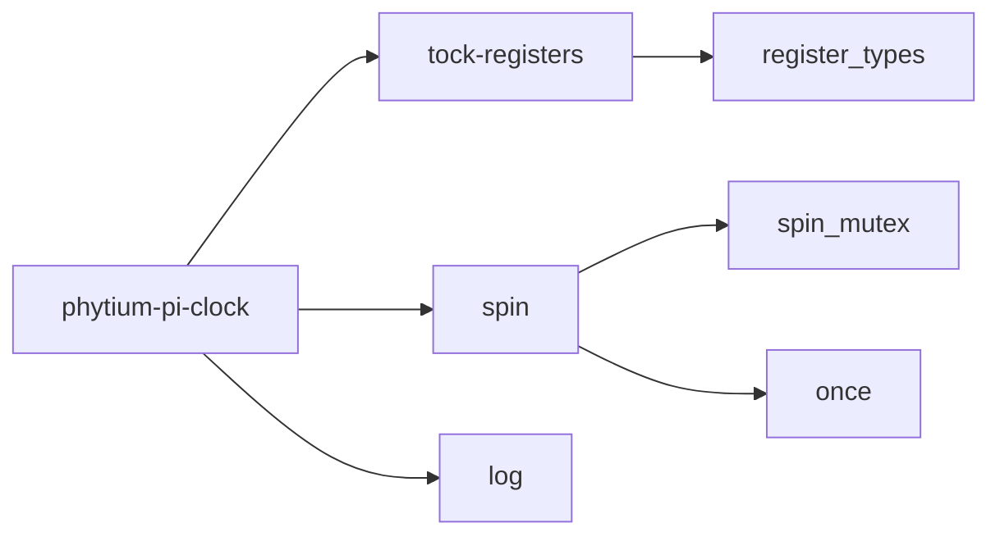

# 项目概述

<cite>
**Referenced Files in This Document **  
- [README.md](file://README.md)
- [Cargo.toml](file://Cargo.toml)
- [src/lib.rs](file://src/lib.rs)
- [examples/basic_usage.rs](file://examples/basic_usage.rs)
</cite>

## 目录
1. [引言](#引言)
2. [项目结构](#项目结构)
3. [核心组件](#核心组件)
4. [架构设计](#架构设计)
5. [详细组件分析](#详细组件分析)
6. [依赖分析](#依赖分析)
7. [性能考量](#性能考量)
8. [故障排除指南](#故障排除指南)
9. [结论](#结论)

## 引言

飞腾派时钟驱动（phytium-pi-clock）是一个专为飞腾派平台设计的Rust语言硬件驱动库，旨在提供安全、线程安全的系统时钟控制功能。该项目采用`no_std`兼容设计，适用于资源受限的嵌入式环境。其主要目标是抽象底层硬件细节，向上层应用或操作系统提供简洁可靠的API接口。

该驱动支持时钟频率设置与获取、时钟使能/禁用控制、时钟状态监控等核心功能，并通过单例模式管理全局时钟实例，确保系统中只有一个有效的时钟控制器存在。基于`tock-registers`的安全寄存器访问机制和`spin::Once`的一次性初始化保证了操作的安全性和可靠性。

本项目面向嵌入式Rust开发者和系统工程师，适用于需要精确时钟控制的物联网设备、边缘计算节点和其他嵌入式应用场景。通过清晰的API设计和模块化架构，开发者可以轻松集成并使用该驱动来实现高效的时钟管理。

## 项目结构

飞腾派时钟驱动项目遵循标准的Rust库项目布局，包含源代码、示例程序、配置文件和文档说明。整体结构清晰，便于理解和维护。

**Diagram sources **  
- [README.md](file://README.md#L0-L119)  
- [Cargo.toml](file://Cargo.toml#L0-L40)  

**Section sources**  
- [README.md](file://README.md#L0-L119)  
- [Cargo.toml](file://Cargo.toml#L0-L40)  

## 核心组件

飞腾派时钟驱动的核心组件包括`ClockController`、`ClockConfig`、`ClockHandle`以及全局时钟实例`GLOBAL_CLOCK`。这些组件共同构成了驱动的基础架构，实现了对硬件时钟的抽象和控制。

`ClockController`负责直接操作硬件寄存器，提供低级的时钟控制功能；`ClockConfig`用于存储时钟控制器的配置信息；`ClockHandle`作为时钟控制句柄管理当前状态；而`GLOBAL_CLOCK`则通过单例模式确保全局唯一性。

此外，`api`模块提供了高层级的便捷函数，简化了常见操作的调用流程。宏`with_clock!`进一步封装了对全局时钟实例的访问逻辑，提高了代码的可读性和安全性。

**Section sources**  
- [src/lib.rs](file://src/lib.rs#L15-L274)  
- [README.md](file://README.md#L20-L40)  

## 架构设计

飞腾派时钟驱动采用分层架构设计，将硬件抽象、状态管理和用户接口分离，提高了代码的可维护性和可扩展性。

**Diagram sources **  
- [src/lib.rs](file://src/lib.rs#L15-L274)  

## 详细组件分析

### ClockController 分析

`ClockController`是驱动的核心硬件抽象组件，负责直接与物理寄存器交互。它通过`NonNull<ClockRegs>`安全地持有寄存器地址，并提供一系列方法来执行具体的时钟控制操作。

#### 类图

**Diagram sources **  
- [src/lib.rs](file://src/lib.rs#L45-L150)  

#### 操作序列图

**Diagram sources **  
- [src/lib.rs](file://src/lib.rs#L85-L120)  
- [src/lib.rs](file://src/lib.rs#L230-L250)  

### 全局时钟管理分析

全局时钟管理采用单例模式结合`spin::Once`实现一次性初始化，确保系统中只有一个有效的时钟控制器实例。

#### 初始化流程图

**Diagram sources **  
- [src/lib.rs](file://src/lib.rs#L180-L200)  

**Section sources**  
- [src/lib.rs](file://src/lib.rs#L45-L274)  
- [examples/basic_usage.rs](file://examples/basic_usage.rs#L0-L64)  

## 依赖分析

飞腾派时钟驱动依赖于几个关键的第三方库，这些库为其提供了必要的功能支持。

**Diagram sources **  
- [Cargo.toml](file://Cargo.toml#L20-L30)  

**Section sources**  
- [Cargo.toml](file://Cargo.toml#L20-L30)  
- [src/lib.rs](file://src/lib.rs#L3-L10)  

## 性能考量

在资源受限的嵌入式环境中，飞腾派时钟驱动的设计充分考虑了性能因素。所有操作都尽可能避免动态内存分配，完全兼容`no_std`环境。寄存器访问经过优化，减少不必要的读写操作。

时钟频率设置过程中采用了简单的轮询等待机制，在实际部署中建议替换为中断驱动的方式以提高效率。分频系数的计算使用整数运算，避免浮点运算带来的开销。

线程安全通过`spin::Mutex`实现，在多核环境下可能产生一定的竞争开销，但在大多数嵌入式场景下是可以接受的。

## 故障排除指南

当遇到时钟驱动相关问题时，可以从以下几个方面进行排查：

1. **初始化失败**：确认`init_clock`只被调用一次，多次初始化会导致错误。
2. **频率设置无效**：检查目标频率是否在有效范围内（196kHz - 50MHz），并验证分频系数计算是否正确。
3. **时钟无法就绪**：增加超时时间或检查硬件连接状态。
4. **编译错误**：确保启用了正确的特性标志，并满足`no_std`环境要求。

日志输出可以帮助定位问题根源，建议在调试阶段启用详细的日志记录。

**Section sources**  
- [src/lib.rs](file://src/lib.rs#L180-L200)  
- [examples/basic_usage.rs](file://examples/basic_usage.rs#L20-L40)  

## 结论

飞腾派时钟驱动通过精心设计的架构和安全的编程实践，为嵌入式系统提供了可靠的时间控制解决方案。其`no_std`兼容性、线程安全特性和简洁的API使其成为Rust嵌入式开发的理想选择。

未来可考虑添加更多高级功能，如时钟源切换、低功耗模式支持等，同时优化等待机制以提升实时性能。总体而言，该项目展示了如何在保证安全性的同时，构建高效且易于使用的硬件驱动程序。