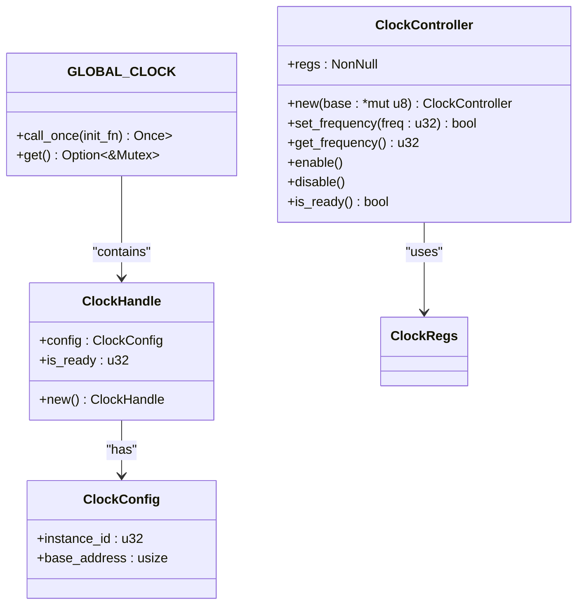
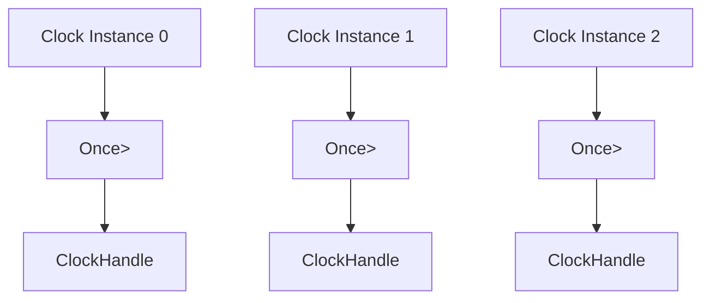
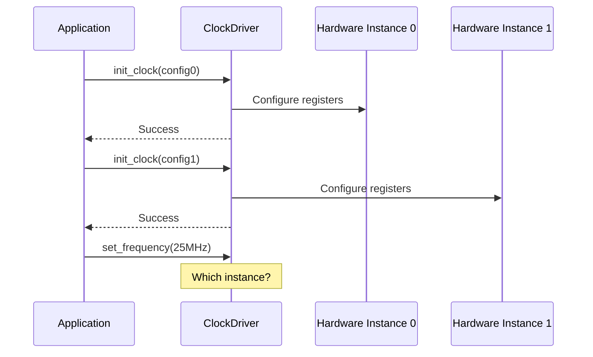

# 多实例支持

<cite>
**Referenced Files in This Document **   
- [lib.rs](file://src/lib.rs)
- [Cargo.toml](file://Cargo.toml)
- [README.md](file://README.md)
</cite>

## 目录
1. [简介](#简介)
2. [当前单实例架构分析](#当前单实例架构分析)
3. [多实例扩展方案](#多实例扩展方案)
4. [并发访问控制策略](#并发访问控制策略)
5. [内存管理与no_std环境考量](#内存管理与no_std环境考量)
6. [初始化顺序与资源冲突](#初始化顺序与资源冲突)
7. [代码示例](#代码示例)

## 简介

本文档详细说明如何将飞腾派时钟驱动从当前的单实例模式扩展为支持多个时钟控制器实例。当前实现通过静态全局变量 `GLOBAL_CLOCK` 仅支持 `instance_id=0` 的单一实例，限制了在具有多个时钟模块的平台上的应用。文档将分析 `lookup_config` 函数对 `instance_id >= 1` 返回 `None` 的限制，指导开发者修改该函数以适配飞腾派平台上可能存在的其他时钟模块，并更新 `init_clock` 逻辑以允许不同基地址的多个实例初始化。

**Section sources**
- [lib.rs](file://src/lib.rs#L0-L274)
- [README.md](file://README.md#L0-L119)

## 当前单实例架构分析

### 架构概览

当前时钟驱动采用单实例设计模式，通过静态全局变量 `GLOBAL_CLOCK` 管理唯一的时钟控制器实例。这种设计简化了API使用，但在需要支持多个物理时钟控制器的场景下存在明显局限。



**Diagram sources **
- [lib.rs](file://src/lib.rs#L0-L274)

**Section sources**
- [lib.rs](file://src/lib.rs#L0-L274)

### 关键限制分析

#### lookup_config 函数限制

当前 `lookup_config` 函数对 `instance_id >= 1` 返回 `None`，这是多实例支持的主要障碍：

```rust
pub fn lookup_config(instance_id: u32) -> Option<ClockConfig> {
    if instance_id >= 1 {
        return None;
    }
    
    Some(ClockConfig {
        instance_id,
        base_address: 0x2800_0000usize,
    })
}
```

此实现硬编码了实例ID检查和基地址，无法适应多个时钟控制器的需求。

#### init_clock 初始化逻辑

`init_clock` 函数依赖于单个 `Once<Mutex<>>` 静态变量，只能初始化一次：

```rust
static GLOBAL_CLOCK: Once<Mutex<ClockHandle>> = Once::new();

pub fn init_clock(config: ClockConfig) -> Result<(), &'static str> {
    GLOBAL_CLOCK.call_once(|| Mutex::new(ClockHandle::new()));
    // ... 其他逻辑
}
```

这种设计阻止了后续实例的初始化。

**Section sources**
- [lib.rs](file://src/lib.rs#L167-L211)

## 多实例扩展方案

### lookup_config 函数改造

为支持多实例，`lookup_config` 函数需要重构以返回不同实例的配置信息。建议采用预定义配置表的方式：

```rust
// 预定义的时钟实例配置
const CLOCK_CONFIGS: &[ClockConfig] = &[
    ClockConfig {
        instance_id: 0,
        base_address: 0x2800_0000usize,
    },
    ClockConfig {
        instance_id: 1,
        base_address: 0x2801_0000usize,
    },
    ClockConfig {
        instance_id: 2,
        base_address: 0x2802_0000usize,
    },
];

pub fn lookup_config(instance_id: u32) -> Option<ClockConfig> {
    CLOCK_CONFIGS.iter()
        .find(|config| config.instance_id == instance_id)
        .copied()
}
```

此方案允许通过简单地扩展配置数组来添加新实例，而无需修改核心逻辑。

### init_clock 多实例初始化

为支持多个实例的初始化，需要引入实例化的管理机制。以下是两种可行方案：

#### 方案一：基于数组的静态实例管理

```rust
// 定义最大实例数量
const MAX_INSTANCES: usize = 3;

// 静态数组存储多个Once<Mutex<>>
static INSTANCE_HANDLES: [Once<Mutex<ClockHandle>>; MAX_INSTANCES] = [
    Once::new(), Once::new(), Once::new()
];

pub fn init_clock(config: ClockConfig) -> Result<(), &'static str> {
    let index = config.instance_id as usize;
    if index >= MAX_INSTANCES {
        return Err("Instance ID out of range");
    }
    
    INSTANCE_HANDLES[index].call_once(|| Mutex::new(ClockHandle::new()));
    
    let handle = INSTANCE_HANDLES[index].get().unwrap();
    let mut guard = handle.lock();
    
    if guard.is_ready == 0x11111111u32 {
        return Err("Clock already initialized");
    }
    
    guard.config = config;
    guard.is_ready = 0x11111111u32;
    
    Ok(())
}
```

#### 方案二：动态实例注册系统

```rust
use core::sync::atomic::{AtomicUsize, Ordering};

// 原子计数器跟踪已初始化的实例
static INITIALIZED_COUNT: AtomicUsize = AtomicUsize::new(0);
static mut INSTANCES: [Option<Mutex<ClockHandle>>; MAX_INSTANCES] = 
    [None, None, None];

pub fn init_clock(config: ClockConfig) -> Result<(), &'static str> {
    let index = config.instance_id as usize;
    if index >= MAX_INSTANCES {
        return Err("Instance ID out of range");
    }
    
    unsafe {
        if INSTANCES[index].is_some() {
            return Err("Clock already initialized");
        }
        
        let handle = Mutex::new(ClockHandle::new());
        INSTANCES[index] = Some(handle);
        
        let mut guard = INSTANCES[index].as_ref().unwrap().lock();
        guard.config = config;
        guard.is_ready = 0x11111111u32;
        
        INITIALIZED_COUNT.fetch_add(1, Ordering::SeqCst);
    }
    
    Ok(())
}
```

**Section sources**
- [lib.rs](file://src/lib.rs#L167-L211)

## 并发访问控制策略

### 每实例独立同步原语

为确保多实例环境下的线程安全，应为每个时钟实例使用独立的 `Once<Mutex<>>` 同步原语：



**Diagram sources **
- [lib.rs](file://src/lib.rs#L168)

这种设计实现了以下优势：
- **隔离性**：各实例的锁互不影响，避免了不必要的竞争
- **可扩展性**：新增实例只需添加相应的同步原语
- **性能**：减少了锁争用，提高了并发性能

### with_clock 宏的多实例适配

现有的 `with_clock` 宏需要扩展以支持实例选择：

```rust
#[macro_export]
macro_rules! with_clock {
    ($instance_id:expr, $op:expr) => {
        {
            use $crate::INSTANCE_HANDLES;
            let index = $instance_id as usize;
            if index >= $crate::MAX_INSTANCES {
                return Err("Invalid instance ID");
            }
            
            if let Some(instance) = INSTANCE_HANDLES[index].get() {
                let handle = instance.lock();
                if handle.is_ready == 0x11111111u32 {
                    let mut controller = unsafe { 
                        $crate::ClockController::new(
                            handle.config.base_address as *mut u8
                        ) 
                    };
                    $op(controller)
                } else {
                    Err("Clock not initialized")
                }
            } else {
                Err("Clock not initialized")
            }
        }
    };
}
```

**Section sources**
- [lib.rs](file://src/lib.rs#L213-L274)

## 内存管理与no_std环境考量

### HashMap 替代方案的挑战

在 `no_std` 环境下直接使用标准库的 `HashMap` 存在以下问题：
- **动态内存分配**：`HashMap` 需要堆分配，而 `no_std` 环境通常禁用或限制堆使用
- **内存碎片**：频繁的插入删除操作可能导致内存碎片
- **确定性**：嵌入式系统要求内存使用具有确定性

### 零成本抽象替代方案

#### 静态查找表

```rust
const MAX_INSTANCES: usize = 3;

struct ClockManager {
    instances: [Option<ClockHandle>; MAX_INSTANCES],
    initialized: [bool; MAX_INSTANCES],
}

impl ClockManager {
    const fn new() -> Self {
        Self {
            instances: [None, None, None],
            initialized: [false, false, false],
        }
    }
    
    fn get_instance(&self, instance_id: u32) -> Option<&ClockHandle> {
        let idx = instance_id as usize;
        if idx < MAX_INSTANCES && self.initialized[idx] {
            self.instances[idx].as_ref()
        } else {
            None
        }
    }
    
    fn init_instance(&mut self, config: ClockConfig) -> Result<(), &'static str> {
        let idx = config.instance_id as usize;
        if idx >= MAX_INSTANCES {
            return Err("Instance ID out of range");
        }
        
        if self.initialized[idx] {
            return Err("Instance already initialized");
        }
        
        self.instances[idx] = Some(ClockHandle::new());
        self.instances[idx].as_mut().unwrap().config = config;
        self.instances[idx].as_mut().unwrap().is_ready = 0x11111111u32;
        self.initialized[idx] = true;
        
        Ok(())
    }
}
```

#### 编译时配置生成

利用Rust的编译时计算能力生成固定大小的数据结构：

```rust
// 使用const fn生成配置映射
const fn build_config_map() -> [Option<ClockConfig>; 4] {
    let mut map = [None; 4];
    map[0] = Some(ClockConfig {
        instance_id: 0,
        base_address: 0x2800_0000,
    });
    map[1] = Some(ClockConfig {
        instance_id: 1,
        base_address: 0x2801_0000,
    });
    map
}
```

**Section sources**
- [Cargo.toml](file://Cargo.toml#L0-L40)

## 初始化顺序与资源冲突

### 初始化顺序问题

在多实例环境中，初始化顺序可能影响系统行为：



解决方案包括：
1. **显式实例指定**：所有API调用必须指定实例ID
2. **默认实例机制**：设置一个默认实例用于简化的API调用
3. **上下文感知**：根据调用上下文自动选择实例

### 资源冲突预防

当多个时钟实例共享某些硬件资源时，可能出现冲突：

```rust
// 检查资源冲突的辅助函数
fn check_resource_conflict(new_config: &ClockConfig) -> Result<(), &'static str> {
    for existing in CLOCK_CONFIGS.iter() {
        // 检查地址空间重叠
        let new_end = new_config.base_address + 0x1000; // 假设每个实例占用4KB
        let existing_end = existing.base_address + 0x1000;
        
        if (new_config.base_address < existing_end) && 
           (new_end > existing.base_address) {
            return Err("Address space conflict detected");
        }
    }
    Ok(())
}
```

**Section sources**
- [lib.rs](file://src/lib.rs#L140-L142)

## 代码示例

### 多实例初始化与使用

```rust
// 初始化多个时钟实例
let config0 = lookup_config(0).unwrap();
let config1 = lookup_config(1).unwrap();

init_clock(config0).unwrap();
init_clock(config1).unwrap();

// 分别控制不同实例
with_clock!(0, |mut controller| {
    controller.set_frequency(25_000_000);
    Ok(())
});

with_clock!(1, |mut controller| {
    controller.set_frequency(50_000_000);
    Ok(())
});
```

### 错误处理最佳实践

```rust
fn safe_configure_clock(instance_id: u32, target_freq: u32) -> Result<(), String> {
    // 1. 查找配置
    let config = lookup_config(instance_id)
        .ok_or_else(|| format!("No configuration for instance {}", instance_id))?;
    
    // 2. 初始化（如果尚未初始化）
    let _ = init_clock(config); // 忽略已初始化的错误
    
    // 3. 执行操作
    with_clock!(instance_id, |mut controller| {
        if controller.set_frequency(target_freq) {
            Ok(())
        } else {
            Err("Failed to set frequency")
        }
    }).map_err(|e| e.to_string())
}
```

**Section sources**
- [lib.rs](file://src/lib.rs#L213-L274)