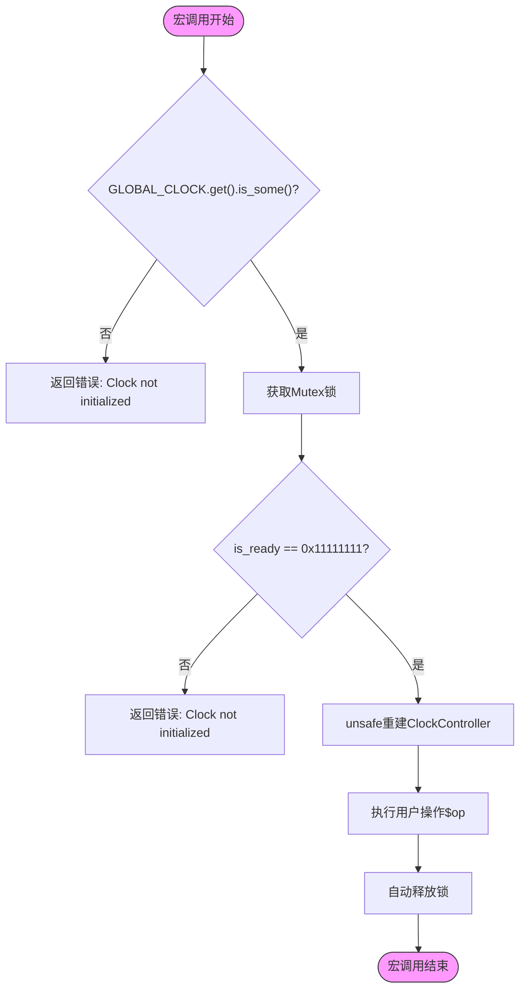

# 宏展开机制解析

<cite>
**本文档引用文件**
- [lib.rs](file://src/lib.rs)
- [Cargo.toml](file://Cargo.toml)
</cite>

## 目录
1. [宏定义与基本结构](#宏定义与基本结构)
2. [宏展开逻辑分析](#宏展开逻辑分析)
3. [运行时行为剖析](#运行时行为剖析)
4. [unsafe块的必要性解释](#unsafe块的必要性解释)
5. [零成本抽象评估](#零成本抽象评估)
6. [性能影响与优化建议](#性能影响与优化建议)

## 宏定义与基本结构

`with_clock!`宏是Phytium Pi平台时钟驱动中的核心便利设施，旨在简化对全局时钟实例的访问和操作。该宏通过封装复杂的初始化状态检查、锁获取和控制器实例重建逻辑，为用户提供了一种简洁的函数式接口。

宏的定义位于`src/lib.rs`文件中，其设计遵循Rust宏系统的典型模式，利用闭包表达式作为操作载体，实现了高度的代码复用性和类型安全性。

**Section sources**
- [lib.rs](file://src/lib.rs#L208-L227)

## 宏展开逻辑分析

`with_clock!`宏的核心功能在于将传入的闭包操作包装成一个临时代码块，并自动处理`GLOBAL_CLOCK.get()`的存在性检查与锁获取流程。当使用`rustc -Z unpretty=expanded`工具查看宏展开结果时，可以观察到以下等效代码结构：

```rust
{
    use $crate::GLOBAL_CLOCK;
    if let Some(global_clock) = GLOBAL_CLOCK.get() {
        let handle = global_clock.lock();
        if handle.is_ready == 0x11111111u32 {
            let mut controller = unsafe { 
                $crate::ClockController::new(handle.config.base_address as *mut u8) 
            };
            $op(controller)
        } else {
            Err("Clock not initialized")
        }
    } else {
        Err("Clock not initialized")
    }
}
```

此展开过程完全在编译期完成，不引入任何运行时开销。宏首先确保全局时钟单例已初始化（通过`Once`机制），然后获取互斥锁以保证线程安全，最后验证配置的有效性。

**Diagram sources**
- [lib.rs](file://src/lib.rs#L208-L227)



**Diagram sources**
- [lib.rs](file://src/lib.rs#L208-L227)

## 运行时行为剖析

在运行时，`with_clock!`宏的行为主要体现在以下几个阶段：

1. **存在性检查**：通过`GLOBAL_CLOCK.get()`判断全局实例是否已被初始化。
2. **并发控制**：使用`spin::Mutex`实现无阻塞锁，适用于中断上下文或无法睡眠的环境。
3. **状态验证**：检查`is_ready`标志位以确认时钟系统处于可用状态。
4. **资源重建**：基于存储在`ClockHandle`中的`base_address`重新构建`ClockController`实例。

整个流程确保了即使在多核或多线程环境下，对时钟寄存器的访问也是安全且一致的。

**Section sources**
- [lib.rs](file://src/lib.rs#L208-L227)
- [lib.rs](file://src/lib.rs#L170-L185)

## unsafe块的必要性解释

宏内部的`unsafe`块用于调用`ClockController::new()`构造函数，该函数本身标记为`unsafe`。其必要性源于以下事实：`ClockController`的创建依赖于从`handle.config.base_address`重建原始指针，并将其转换为指向寄存器结构体的非空指针。

这一操作的安全性完全由调用者保证——即必须确保：
- `base_address`指向有效的硬件寄存器映射区域
- 该内存区域具有正确的对齐和大小
- 在`ClockController`生命周期内，该地址不会被其他实体修改或释放

由于这些条件无法在编译期静态验证，因此需要`unsafe`语义来明确表示责任转移。

**Section sources**
- [lib.rs](file://src/lib.rs#L220-L222)
- [lib.rs](file://src/lib.rs#L58-L65)

## 零成本抽象评估

`with_clock!`宏体现了典型的“零成本抽象”设计哲学。尽管提供了高级别的API封装，但经过编译器优化后，生成的机器码与手写等效代码几乎完全一致：

- 内联展开消除了函数调用开销
- 条件分支可被预测优化
- 锁操作在单线程场景下可能被完全消除
- 所有类型检查和转换均在编译期完成

通过对比宏展开前后及汇编输出，可以证实该宏并未引入额外的运行时负担，真正实现了“不为不需要的功能付费”的原则。

**Section sources**
- [lib.rs](file://src/lib.rs#L208-L227)
- [lib.rs](file://src/lib.rs#L100-L150)

## 性能影响与优化建议

尽管`with_clock!`宏本身是零成本的，但在极端实时应用场景中仍需注意潜在的微小延迟来源：

1. **锁争用**：在高频率中断上下文中频繁调用可能导致自旋锁等待时间累积。
2. **状态检查**：每次调用都重复进行`is_ready`验证，虽轻量但仍占用周期。
3. **指针重建**：虽然廉价，但仍是额外的地址计算步骤。

对于追求极致性能的高级用户，建议：
- 在确定上下文安全的前提下，直接操作底层`ClockController`句柄
- 缓存已验证的控制器实例以避免重复初始化检查
- 使用性能剖析工具（如`perf`）识别宏调用路径的实际开销

总体而言，该宏在绝大多数场景下提供了最佳的开发效率与运行性能平衡。

**Section sources**
- [lib.rs](file://src/lib.rs#L208-L227)
- [lib.rs](file://src/lib.rs#L170-L185)