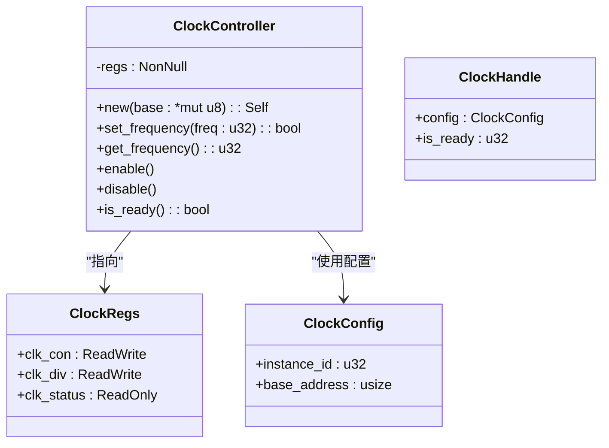
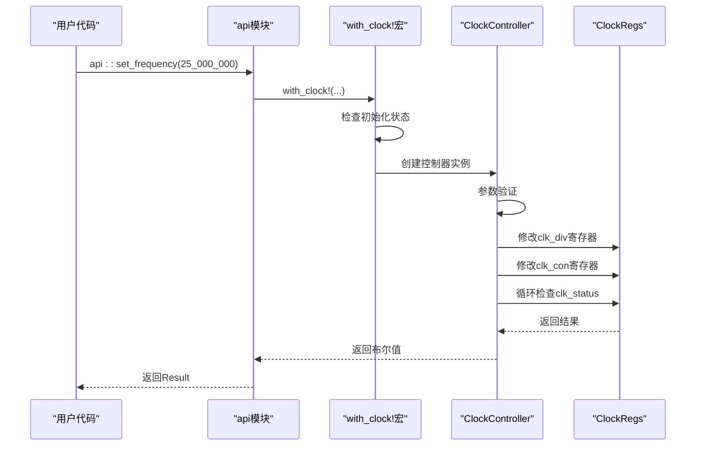
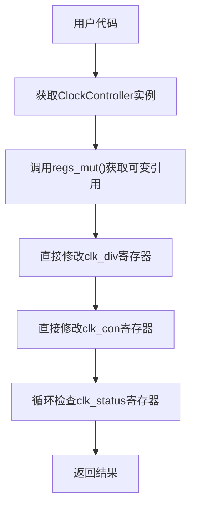

# 直接寄存器操作

<cite>
**Referenced Files in This Document**   
- [lib.rs](file://src/lib.rs)
</cite>

## 目录
1. [引言](#引言)
2. [核心组件分析](#核心组件分析)
3. [直接寄存器操作详解](#直接寄存器操作详解)
4. [性能对比分析](#性能对比分析)
5. [安全性与最佳实践](#安全性与最佳实践)

## 引言
本文档深入讲解如何绕过高层次API，直接操作底层`ClockRegs`结构体进行精细控制。通过分析飞腾派平台时钟驱动的实现，展示如何利用`register_structs!`和`register_bitfields!`宏生成的类型，结合`NonNull::as_ref()`方法获取寄存器引用后，手动读写`clk_con`、`clk_div`和`clk_status`字段的具体方法。

## 核心组件分析

本节分析时钟驱动的核心数据结构和寄存器定义。



**Diagram sources**
- [lib.rs](file://src/lib.rs#L10-L274)

**Section sources**
- [lib.rs](file://src/lib.rs#L10-L274)

## 直接寄存器操作详解

### 寄存器结构体定义

驱动使用`register_structs!`宏定义了`ClockRegs`结构体，该结构体映射到硬件寄存器的内存布局：

```rust
register_structs! {
    pub ClockRegs {
        (0x00 => clk_con: ReadWrite<u32, CLK_CON::Register>),
        (0x04 => clk_div: ReadWrite<u32, CLK_DIV::Register>),
        (0x08 => clk_status: ReadOnly<u32, CLK_STATUS::Register>),
        (0x0c => @END),
    }
}
```

此宏生成的代码确保了寄存器字段在内存中的偏移量正确对应硬件规格（CLK_CON在0x00，CLK_DIV在0x04，CLK_STATUS在0x08）。

### 位字段定义

`register_bitfields!`宏用于定义各个寄存器的位字段：

```rust
register_bitfields![u32,
    CLK_CON [
        ENABLE OFFSET(0) NUMBITS(1) [],
        SOURCE OFFSET(1) NUMBITS(3) [],
    ],
    CLK_DIV [
        DIV OFFSET(0) NUMBITS(8) [],
    ],
    CLK_STATUS [
        READY OFFSET(0) NUMBITS(1) [],
    ],
];
```

这些定义允许开发者以类型安全的方式访问寄存器的特定位域，避免了直接的位操作错误。

### 获取寄存器引用

`ClockController`通过`NonNull::as_ref()`方法获取对寄存器的引用：

[SPEC SYMBOL](file://src/lib.rs#L69-L72)
[SPEC SYMBOL](file://src/lib.rs#L75-L78)

这种方法是安全的，因为：
1. `NonNull`保证指针非空
2. 调用者负责确保基地址指向有效的寄存器区域
3. 生命周期管理由`ClockController`实例控制

### 手动寄存器操作示例

#### 设置分频系数

直接设置分频系数的方法：

[SPEC SYMBOL](file://src/lib.rs#L108-L110)

这等价于直接写入`clk_div`寄存器的低8位，分频系数值为`SYS_CLK_HZ / freq`。

#### 查询就绪状态

查询时钟是否准备就绪：

[SPEC SYMBOL](file://src/lib.rs#L160-L163)

通过读取`clk_status`寄存器的READY位来判断时钟状态。

#### 使能/禁用时钟

直接控制时钟使能位：

[SPEC SYMBOL](file://src/lib.rs#L147-L155)

通过修改`clk_con`寄存器的ENABLE位来控制时钟的开启和关闭。

**Section sources**
- [lib.rs](file://src/lib.rs#L10-L274)

## 性能对比分析

### 高层次API调用路径

高层次API的调用涉及多个抽象层：



**Diagram sources**
- [lib.rs](file://src/lib.rs#L220-L250)

### 直接寄存器操作路径

直接操作寄存器的调用路径更为简洁：



**Diagram sources**
- [lib.rs](file://src/lib.rs#L100-L163)

### 性能开销对比

| 操作 | 高层次API开销 | 直接寄存器操作开销 |
|------|---------------|-------------------|
| 函数调用 | 多层函数调用 | 单层函数调用 |
| 状态检查 | 全局锁+初始化检查 | 无额外检查 |
| 错误处理 | Result类型包装 | 布尔值返回 |
| 内联优化 | 可能无法完全内联 | 更容易被编译器内联 |

直接寄存器操作避免了`with_clock!`宏的全局状态检查和`Result`类型的包装开销，在性能敏感场景下具有明显优势。

**Section sources**
- [lib.rs](file://src/lib.rs#L80-L274)

## 安全性与最佳实践

### 安全性要求

直接操作底层寄存器属于`unsafe`操作，必须满足以下条件：

1. **地址映射正确**：确保传入的基地址确实指向有效的时钟控制器寄存器区域
2. **无竞态条件**：在多线程环境中，必须确保对寄存器的访问是线程安全的
3. **生命周期管理**：确保寄存器引用的生命周期不超过硬件的有效期

### 使用建议

建议仅在以下场景使用直接寄存器操作：

- **性能敏感代码**：如中断处理程序、实时任务
- **调试场景**：需要精确控制寄存器状态进行故障排查
- **特殊功能**：高层API未覆盖的特定硬件功能

### 编译器优化注意事项

Rust编译器可能会对内存访问进行优化，导致预期之外的行为。为防止此类问题：

1. 使用`volatile`访问模式（由`tock-registers`库保证）
2. 避免过度优化关键路径
3. 在必要时使用`compiler_fence`或`asm!`确保内存顺序

### 最佳实践示例

```rust
// 性能敏感场景下的直接操作
let mut controller = unsafe { ClockController::new(0x2800_0000 as *mut u8) };

// 直接设置分频系数
controller.regs_mut().clk_div.write(CLK_DIV::DIV.val(2));

// 使能时钟
controller.regs_mut().clk_con.modify(CLK_CON::ENABLE::SET);

// 等待就绪（注意：实际应用中应有超时机制）
while !controller.is_ready() {
    // 空循环等待
}
```

**Section sources**
- [lib.rs](file://src/lib.rs#L1-L274)