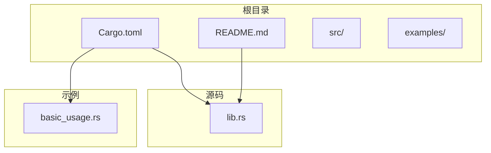
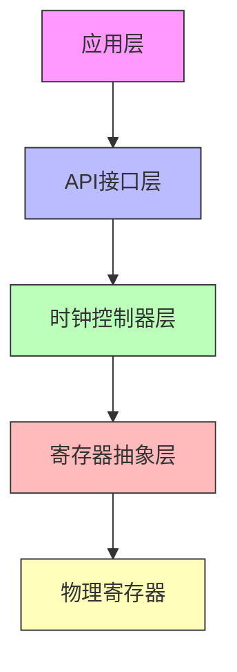
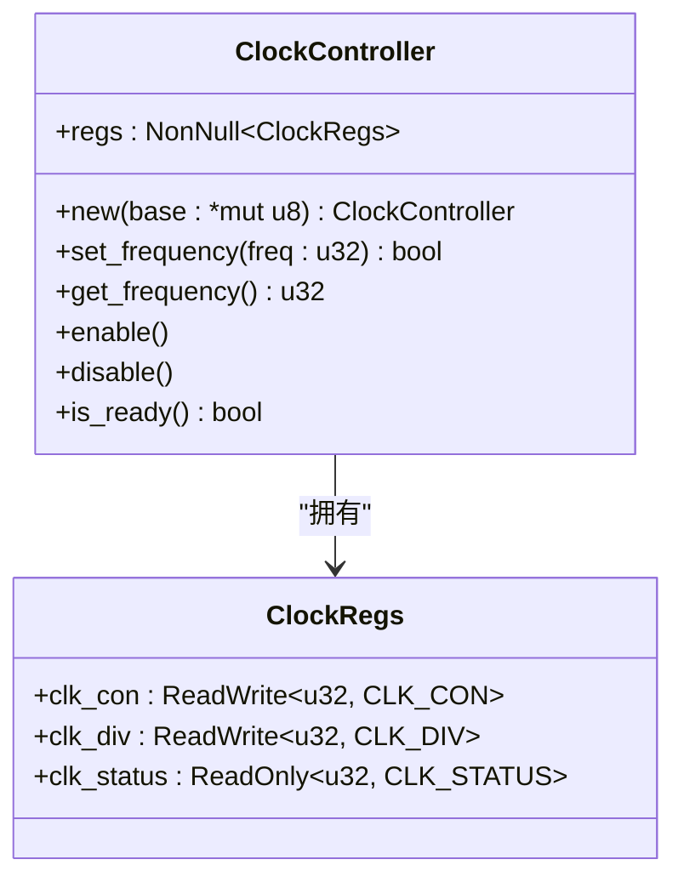
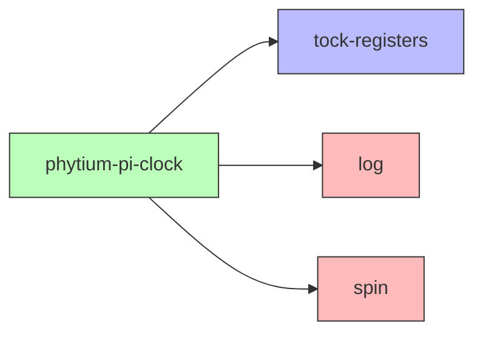

# 系统集成

<cite>
**本文档中引用的文件**
- [lib.rs](file://src/lib.rs)
- [Cargo.toml](file://Cargo.toml)
- [basic_usage.rs](file://examples/basic_usage.rs)
- [README.md](file://README.md)
</cite>

## 目录
1. [引言](#引言)
2. [项目结构](#项目结构)
3. [核心组件](#核心组件)
4. [架构概述](#架构概述)
5. [详细组件分析](#详细组件分析)
6. [依赖分析](#依赖分析)
7. [性能考虑](#性能考虑)
8. [故障排除指南](#故障排除指南)
9. [结论](#结论)

## 引言
飞腾派时钟驱动为Phytium Pi平台提供系统时钟的配置与管理功能，支持频率调节、时钟使能控制及状态监控。本文档重点探讨该驱动如何与更复杂的系统环境（如RTOS或ArceOS HAL框架）进行集成，分析其设计意图，并指导开发者实现跨平台一致性调用和动态频率调节策略。

## 项目结构
该项目采用标准Rust库结构，包含源码目录`src/`、示例代码`examples/`、构建配置`Cargo.toml`以及说明文档`README.md`。整体组织清晰，便于嵌入式系统集成使用。



**图示来源**
- [Cargo.toml](file://Cargo.toml#L0-L40)
- [lib.rs](file://src/lib.rs#L0-L274)
- [basic_usage.rs](file://examples/basic_usage.rs#L0-L64)

**本节来源**
- [Cargo.toml](file://Cargo.toml#L0-L40)
- [README.md](file://README.md#L0-L120)

## 核心组件
驱动的核心是`ClockController`结构体，封装了对硬件寄存器的访问逻辑，提供安全的时钟频率设置接口。通过`GLOBAL_CLOCK`静态实例实现全局单例管理，确保多任务环境下的线程安全访问。

**本节来源**
- [lib.rs](file://src/lib.rs#L0-L274)

## 架构概述
驱动采用分层设计模式：底层为寄存器抽象层（基于tock-registers），中间为硬件控制器封装层（ClockController），上层为API接口层（api模块）。这种设计有利于解耦硬件操作与业务逻辑，提升可维护性。



**图示来源**
- [lib.rs](file://src/lib.rs#L0-L274)

## 详细组件分析

### ClockController 分析
`ClockController` 是驱动的核心类，负责直接操作时钟控制器寄存器。它通过`NonNull<ClockRegs>`持有寄存器映射地址，提供了频率设置、使能控制和状态查询等方法。

#### 类图


**图示来源**
- [lib.rs](file://src/lib.rs#L0-L55)

### 全局时钟管理机制
驱动通过`Once<Mutex<ClockHandle>>`实现延迟初始化且线程安全的全局时钟实例。`with_clock!`宏封装了对全局状态的安全访问流程，避免竞态条件。

#### 宏展开流程图
```mermaid
flowchart TD
Start([开始]) --> CheckGlobal{"GLOBAL_CLOCK.get().is_some()?"}
CheckGlobal --> |否| ReturnErr1["返回 Err(\"Clock not initialized\")"]
CheckGlobal --> |是| LockHandle["获取 handle = global_clock.lock()"]
LockHandle --> CheckReady{"handle.is_ready == 0x11111111?"}
CheckReady --> |否| ReturnErr2["返回 Err(\"Clock not initialized\")"]
CheckReady --> |是| CreateController["创建 controller 实例"]
CreateController --> ExecuteOp["执行传入的操作 $op(controller)"]
ExecuteOp --> End([结束])
ReturnErr1 --> End
ReturnErr2 --> End
```

**图示来源**
- [lib.rs](file://src/lib.rs#L213-L274)

**本节来源**
- [lib.rs](file://src/lib.rs#L0-L274)

## 依赖分析
驱动依赖于轻量级嵌入式库，适配`no_std`环境：



**图示来源**
- [Cargo.toml](file://Cargo.toml#L15-L21)

**本节来源**
- [Cargo.toml](file://Cargo.toml#L15-L21)

## 性能考虑
驱动在`set_frequency`中采用了自旋等待方式检查时钟就绪状态，适用于启动阶段但不适合高实时性场景。建议在RTOS环境中替换为中断驱动或事件通知机制以提高效率。

## 故障排除指南
常见问题包括未正确初始化时钟、频率超出范围或寄存器访问失败。可通过日志输出判断初始化状态，确认基地址配置正确，并验证硬件连接。

**本节来源**
- [lib.rs](file://src/lib.rs#L167-L211)
- [basic_usage.rs](file://examples/basic_usage.rs#L0-L64)

## 结论
飞腾派时钟驱动具备良好的可扩展性和线程安全性，适合集成至复杂嵌入式系统。通过启用`axhal`特性可对接ArceOS HAL框架，实现统一外设抽象；结合调度器可在多任务环境下实施DVFS策略，优化功耗表现。