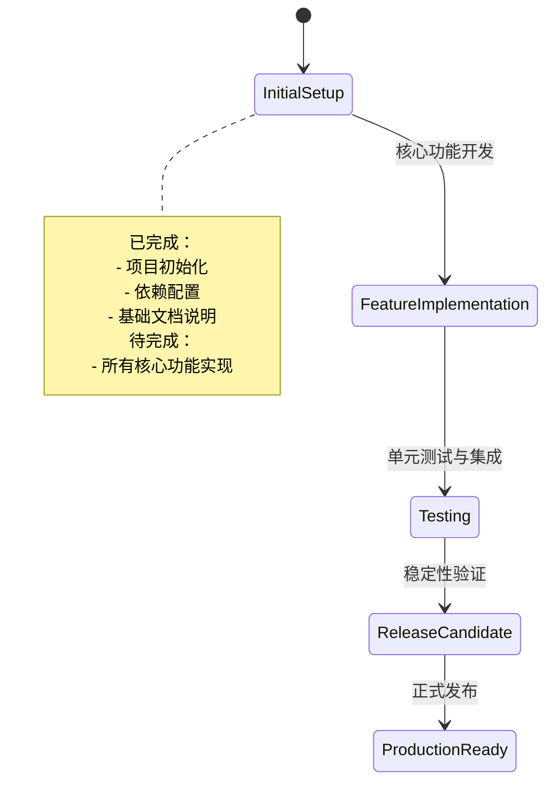
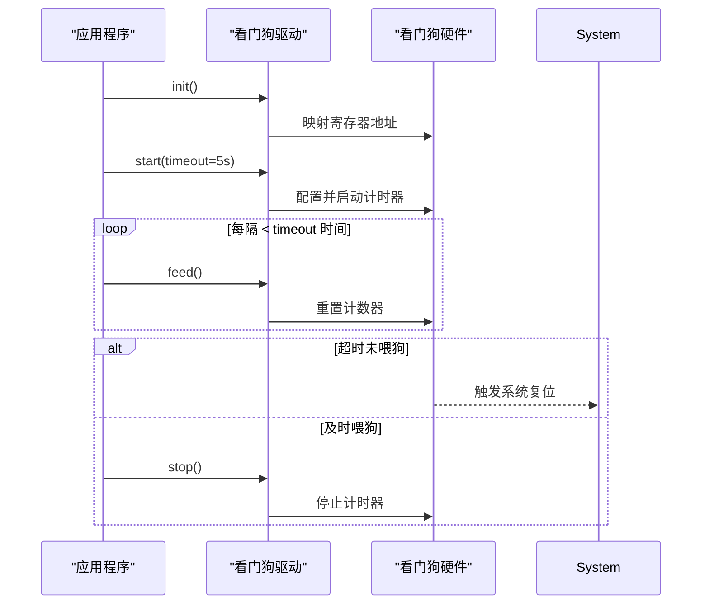

# 开发进度与路线图

<cite>
**本文档引用的文件**
- [lib.rs](file://src/lib.rs)
- [Cargo.toml](file://Cargo.toml)
</cite>

## 目录
1. [项目概述](#项目概述)
2. [当前开发状态](#当前开发状态)
3. [待实现核心功能模块](#待实现核心功能模块)
4. [技术实现思路](#技术实现思路)
5. [服务闭环设计](#服务闭环设计)
6. [未来扩展方向](#未来扩展方向)
7. [总结](#总结)

## 项目概述

本项目旨在为飞腾派（Phytium Pi）平台开发一个专用的看门狗定时器驱动程序。该驱动将作为系统可靠性保障的关键组件，通过监控应用程序运行状态，在异常情况下触发系统复位以恢复服务。项目基于 `no_std` 环境构建，适用于嵌入式和操作系统底层场景。

**Section sources**
- [lib.rs](file://src/lib.rs#L1-L4)
- [Cargo.toml](file://Cargo.toml#L1-L10)

## 当前开发状态

目前项目已完成初始框架搭建，包括基础包配置、依赖项引入以及核心模块的初步声明。根据源码中的 TODO 注释，所有核心功能尚未实现，当前处于开发初期阶段。`src/lib.rs` 文件中仅包含必要的属性声明和注释说明，未定义任何具体结构体或方法。

**Diagram sources**
- [lib.rs](file://src/lib.rs#L1-L4)

**Section sources**
- [lib.rs](file://src/lib.rs#L3)

## 待实现核心功能模块

根据系统需求，需完成以下关键功能模块的开发：

| 功能模块 | 描述 |
|--------|------|
| 初始化 | 完成硬件寄存器映射与驱动上下文初始化 |
| 启动/停止控制 | 提供接口用于激活或禁用看门狗计时器 |
| 超时值配置 | 支持设置不同的超时周期（如 1s, 5s, 10s 等） |
| 心跳喂狗操作 | 应用程序定期调用以重置计时器 |
| 故障诊断接口 | 查询当前状态、错误计数及最后复位原因 |

这些功能共同构成完整的看门狗服务能力。

**Section sources**
- [lib.rs](file://src/lib.rs#L3)

## 技术实现思路

各功能模块的技术实现路径如下：

- **初始化**：通过内存映射获取看门狗硬件寄存器地址，并利用 `tock-registers` 库进行安全访问。初始化过程中应检查设备是否存在并完成基本配置。
- **启动/停止控制**：定义 `start()` 和 `stop()` 方法，分别向控制寄存器写入启用/禁用标志位，确保原子操作以避免竞态条件。
- **超时值配置**：提供 `set_timeout(duration)` 接口，将时间参数转换为对应的预分频值和重载值写入寄存器。
- **心跳喂狗操作**：实现 `feed()` 方法，向特定寄存器写入“喂狗”命令，重置内部计数器。
- **故障诊断接口**：实现 `diagnose()` 方法，读取状态寄存器以返回当前运行状态、是否发生过超时以及最近一次复位的原因。

所有操作均需考虑并发安全性，建议使用 `spin::Mutex` 对共享资源进行保护。

**Section sources**
- [lib.rs](file://src/lib.rs#L3)
- [Cargo.toml](file://Cargo.toml#L11-L14)

## 服务闭环设计

完整的看门狗服务闭环如下图所示：

**Diagram sources**
- [lib.rs](file://src/lib.rs#L3)

**Section sources**
- [lib.rs](file://src/lib.rs#L3)

## 未来扩展方向

在基础功能稳定后，可规划以下扩展方向：

- **多种超时模式支持**：增加窗口式看门狗（Windowed Watchdog）模式，要求在指定时间窗口内喂狗，防止任务过早或过晚执行。
- **中断通知机制**：在超时前一定时间触发中断，允许系统尝试自我修复而无需立即复位。
- **运行时参数调整**：支持动态修改超时值而不重启驱动。
- **多实例管理**：若平台存在多个看门狗单元，需支持统一调度与管理。
- **日志与统计增强**：记录喂狗频率、超时次数等信息，便于系统健康度分析。

这些扩展将进一步提升驱动的灵活性与实用性。

**Section sources**
- [lib.rs](file://src/lib.rs#L3)

## 总结

本文档明确了飞腾派看门狗驱动的当前开发状态——初始框架已就绪，但所有核心功能尚待实现。列出了五大待开发模块：初始化、启停控制、超时配置、喂狗操作与诊断接口，并提出了基于 `tock-registers` 的技术实现方案。同时描绘了从应用到硬件的服务闭环流程，并展望了未来的扩展可能性。此路线图为后续开发提供了清晰指引，下一步应优先实现各核心接口并编写单元测试验证其正确性。

[无来源，本节为总结性内容]