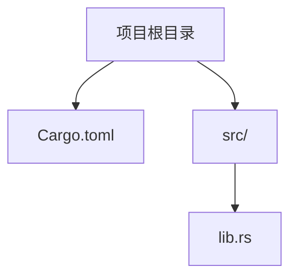
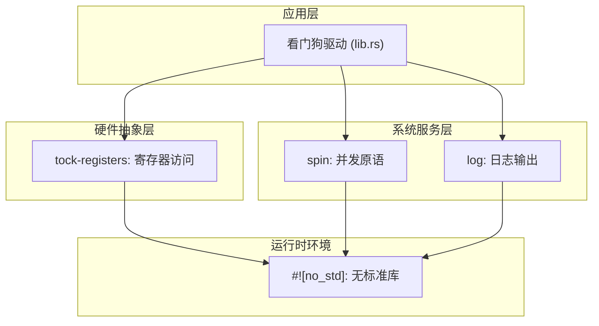
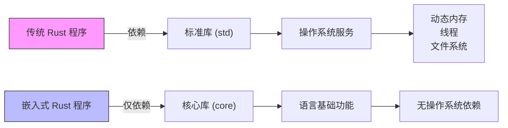

# 技术架构

<cite>
**Referenced Files in This Document**   
- [lib.rs](file://src/lib.rs)
- [Cargo.toml](file://Cargo.toml)
</cite>

## 目录
1. [简介](#简介)
2. [项目结构](#项目结构)
3. [核心组件](#核心组件)
4. [架构概述](#架构概述)
5. [详细组件分析](#详细组件分析)
6. [依赖分析](#依赖分析)
7. [性能考量](#性能考量)
8. [故障排除指南](#故障排除指南)
9. [结论](#结论)

## 简介
本文档深入分析了飞腾派看门狗驱动的技术架构，重点阐述了在嵌入式环境中采用#![no_std]设计范式的原因与优势。通过解析`lib.rs`中的核心声明和`Cargo.toml`中的依赖配置，展示了如何构建一个轻量级、安全的设备驱动基础。文档详细说明了三个关键依赖库——tock-registers、log和spin——的作用机制及其特定功能选项，解释了为何禁用默认功能以优化二进制体积，并讨论了该架构对未来实现看门狗初始化和喂狗操作等核心功能的支撑作用。

## 项目结构
该项目采用典型的Rust嵌入式驱动项目布局，包含一个源代码目录和一个Cargo配置文件。根目录下的`Cargo.toml`定义了包元数据和外部依赖，`src`目录下的`lib.rs`是唯一的源文件，作为整个库的入口点。这种简洁的结构反映了驱动程序专注于单一硬件功能（看门狗定时器）的设计目标。



**Diagram sources**
- [Cargo.toml](file://Cargo.toml#L1-L14)
- [lib.rs](file://src/lib.rs#L1-L4)

**Section sources**
- [Cargo.toml](file://Cargo.toml#L1-L14)
- [lib.rs](file://src/lib.rs#L1-L4)

## 核心组件
本项目的核心组件围绕着为飞腾派平台提供看门狗定时器支持而构建。尽管当前实现尚处于待完成状态（TODO注释表明），但其架构基础已通过#![no_std]属性和精心选择的依赖项确立。核心关注点在于确保驱动能够在无标准库的受限环境中安全、可靠地运行，直接与硬件寄存器交互并处理潜在的并发访问。

**Section sources**
- [lib.rs](file://src/lib.rs#L1-L4)
- [Cargo.toml](file://Cargo.toml#L1-L14)

## 架构概述
该驱动的架构设计遵循了现代Rust嵌入式开发的最佳实践，即最小化依赖、最大化安全性。整体架构分为三个层次：运行时环境层（由#![no_std]定义）、硬件抽象层（由tock-registers提供）和系统服务层（由log和spin提供）。这种分层设计确保了代码的可维护性和可移植性。



**Diagram sources**
- [lib.rs](file://src/lib.rs#L1-L4)
- [Cargo.toml](file://Cargo.toml#L10-L14)

## 详细组件分析

### 核心设计原则分析
#### no_std 设计选择
#![no_std]属性是本项目最根本的设计决策。它指示编译器不链接Rust的标准库（std），而是使用更小、更基础的核心库（core）。这对于资源受限的嵌入式环境至关重要，因为标准库依赖于操作系统提供的动态内存分配、线程和文件系统等功能，而这些在裸机或微内核环境中通常是不可用的。通过采用no_std，驱动程序可以被集成到ArceOS这样的操作系统中，或者直接在裸机上运行，从而极大地减少了二进制体积和运行时开销。



**Diagram sources**
- [lib.rs](file://src/lib.rs#L1)

#### tock-registers 组件分析
tock-registers库提供了对硬件寄存器进行类型安全访问的机制。在嵌入式编程中，直接读写内存映射的I/O寄存器是常见操作，但极易出错。tock-registers通过Rust的类型系统将寄存器的位域（bitfields）和访问权限（只读、只写、读写）编码到类型中，从而在编译时防止无效的寄存器操作。这不仅提高了代码的安全性，也使其更具可读性。

```mermaid
classDiagram
    class Register {
        +read() Value
        +write(value)
        +modify(f)
    }
    
    class ReadOnlyRegister {
        +read() Value
    }
    
    class WriteOnlyRegister {
        +write(value)
    }
    
    class ReadWriteRegister {
        +read() Value
        +write(value)
        +modify(f)
    }
    
    Register <|-- ReadOnlyRegister
    Register <|-- WriteOnlyRegiste