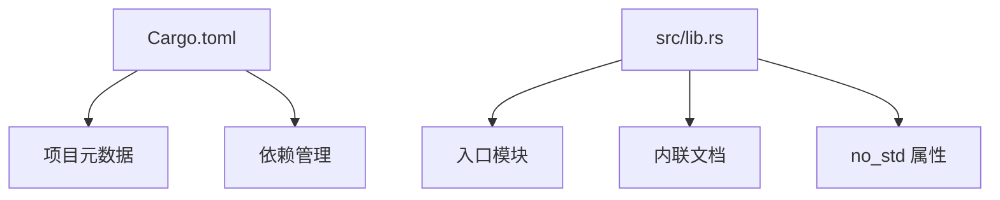

<cite>
**本文档中引用的文件**
- [Cargo.toml](file://Cargo.toml)
- [src/lib.rs](file://src/lib.rs)
</cite>

## 目录
1. [简介](#简介)
2. [项目结构](#项目结构)
3. [Cargo.toml 文件详解](#cargo.toml-文件详解)
4. [src/lib.rs 文件解析](#srclib.rs-文件解析)
5. [依赖项用途说明](#依赖项用途说明)
6. [开发任务与扩展指导](#开发任务与扩展指导)
7. [总结](#总结)

## 简介

本项目为飞腾平台（Phytium Pi）的看门狗定时器驱动程序，采用 Rust 语言编写，遵循嵌入式系统开发的最佳实践。文档将详细解释项目中各文件的作用与结构，重点分析 `Cargo.toml` 和 `src/lib.rs` 文件的核心内容，并阐明如何在此基础上进行功能扩展。

## 项目结构

该项目采用标准的 Rust 库项目布局，结构简洁清晰：

```
.
├── src
│   └── lib.rs          # 库的主源文件
└── Cargo.toml          # 项目配置和依赖管理文件
```

尽管当前实现较为简单，但已具备良好的可扩展性基础。随着功能逐步完善，可在 `src` 目录下添加模块文件或子目录以组织更多代码。



**Diagram sources**
- [Cargo.toml](file://Cargo.toml#L1-L15)
- [src/lib.rs](file://src/lib.rs#L1-L4)

**Section sources**
- [Cargo.toml](file://Cargo.toml#L1-L15)
- [src/lib.rs](file://src/lib.rs#L1-L4)

## Cargo.toml 文件详解

`Cargo.toml` 是 Rust 项目的配置文件，定义了项目的基本信息和依赖关系。

### [package] 段落字段含义

- **name**: 项目名称 `"phytium-pi-watchdog"`，在包注册表中唯一标识该库。
- **version**: 当前版本号 `"0.1.0"`，遵循语义化版本规范。
- **edition**: 使用的 Rust 版本 `"2021"`，确保编译器使用正确的语法和特性。
- **authors**: 作者列表 `["Phytium Pi Driver Team"]`，记录维护者信息。
- **description**: 项目描述 `"Watchdog timer driver for Phytium Pi platform"`，简要说明功能。
- **repository**: 源码仓库地址，便于用户获取完整项目。
- **license**: 许可协议 `"GPL-2.0 OR Apache-2.0"`，声明开源许可方式。
- **keywords** 和 **categories**: 帮助在 crates.io 上分类和搜索，包含 `"embedded"`, `"driver"`, `"no-std"` 等关键词。

这些元数据不仅用于构建系统识别项目，也方便其他开发者在包管理器中发现和理解本库的用途。

**Section sources**
- [Cargo.toml](file://Cargo.toml#L1-L10)

## src/lib.rs 文件解析

`src/lib.rs` 是 Rust 库的入口文件，包含以下关键元素：

- `#![no_std]` 属性：表明该库不依赖标准库（std），仅使用核心库（core）。这对于嵌入式环境至关重要，因为它避免了对操作系统服务的依赖，使代码可以在裸机或受限环境中运行。
- `//!` 内联文档注释：这是一种模块级文档注释，生成 crate 级别的说明文档。它会被 `cargo doc` 工具提取并生成 HTML 文档首页内容，向使用者介绍库的功能和用法。
- `// TODO:` 注释：明确指出当前开发任务是“实现完整的看门狗驱动功能”，提示后续需补充寄存器操作、初始化逻辑、喂狗机制等具体实现。

此文件虽短，但已正确设置了嵌入式 Rust 开发的基础框架。

**Section sources**
- [src/lib.rs](file://src/lib.rs#L1-L4)

## 依赖项用途说明

`[dependencies]` 部分列出了项目所依赖的外部 crate 及其配置原因：

- **tock-registers**: 版本 `0.8`，禁用默认功能，启用 `register_types` 特性。该库提供类型安全的硬件寄存器访问机制，适用于操作系统或驱动开发场景。启用 `register_types` 可使用预定义的寄存器类型进行内存映射 I/O 操作。
- **log**: 版本 `0.4`，禁用默认功能。作为日志抽象接口，允许在无标准库环境下输出调试信息。通常配合具体的日志实现（如 `defmt` 或 `slog`）使用，适合资源受限设备。
- **spin**: 版本 `0.9`，禁用默认功能，启用 `spin_mutex` 和 `once` 特性。提供自旋锁（Spinlock）和 `Once` 初始化原语，适用于多线程或中断上下文中的同步需求，在 `no_std` 环境中替代标准库的互斥量。

所有依赖均显式关闭默认功能以减小二进制体积，仅启用必要特性，符合嵌入式开发的最小化原则。

**Section sources**
- [Cargo.toml](file://Cargo.toml#L11-L15)

## 开发任务与扩展指导

当前项目处于初始阶段，主要开发任务是完成看门狗驱动的具体功能实现。建议按以下步骤进行扩展：

1. **添加模块结构**：在 `src/lib.rs` 中通过 `mod` 关键字引入新模块，例如 `mod registers;` 用于封装寄存器定义。
2. **定义结构体**：创建表示看门狗控制器的结构体，如 `struct Watchdog { base_address: usize }`。
3. **实现功能块**：使用 `impl` 块为结构体添加方法，包括 `new()`、`start()`、`feed()`、`stop()` 等接口。
4. **集成寄存器访问**：利用 `tock-registers` 定义寄存器映射，并通过内存地址实例化进行读写操作。
5. **加入日志输出**：在关键路径调用 `log::info!()` 或 `log::error!()` 提供运行时反馈。
6. **确保线程安全**：若需共享实例，使用 `spin::Mutex` 包装资源以支持并发访问。

通过上述步骤，可逐步构建出一个完整、健壮且易于维护的看门狗驱动程序。

**Section sources**
- [src/lib.rs](file://src/lib.rs#L1-L4)
- [Cargo.toml](file://Cargo.toml#L11-L15)

## 总结

本项目已建立符合 Rust 嵌入式开发规范的基础架构。`Cargo.toml` 正确配置了元数据与精简依赖，`src/lib.rs` 设置了 `no_std` 环境并提供了文档框架。开发者应基于现有结构继续完善功能，最终实现一个高效、安全的飞腾平台看门狗驱动。