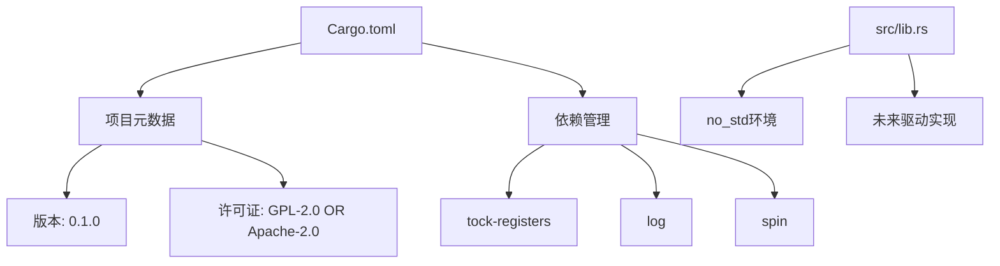
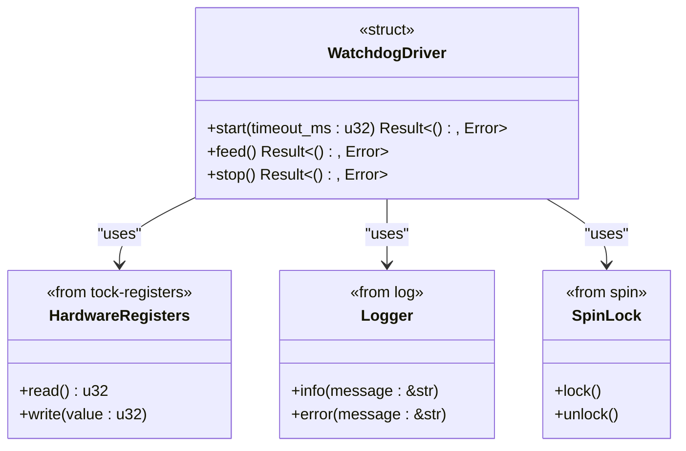

# 项目概述

<cite>
**本文档引用的文件**
- [Cargo.toml](file://Cargo.toml)
- [src/lib.rs](file://src/lib.rs)
</cite>

## 目录
1. [简介](#简介)
2. [项目结构](#项目结构)
3. [核心功能与目标](#核心功能与目标)
4. [技术背景说明](#技术背景说明)
5. [元数据信息](#元数据信息)
6. [开发状态与未来方向](#开发状态与未来方向)
7. [许可证说明](#许可证说明)

## 简介

`phytium-pi-watchdog` 是一个为 Phytium Pi 平台设计的看门狗定时器驱动程序，旨在为嵌入式系统提供关键的可靠性保障机制。该项目基于 Rust 编程语言开发，遵循 `no_std` 原则，适用于资源受限的嵌入式环境。

看门狗定时器（Watchdog Timer）是一种硬件或软件机制，用于监控系统的运行状态。当系统因软件故障、死锁或其他异常情况而停止响应时，看门狗能够自动触发系统重启，从而恢复设备的正常运行。这对于无人值守或远程部署的嵌入式设备尤为重要。

本项目的目标用户主要为嵌入式 Rust 开发者和系统工程师，他们需要在 Phytium Pi 平台上构建高可靠性的应用系统。通过提供一个专用的看门狗驱动，该项目填补了该平台底层支持的空白。

**Section sources**
- [Cargo.toml](file://Cargo.toml#L1-L15)
- [src/lib.rs](file://src/lib.rs#L1-L4)

## 项目结构

该项目采用标准的 Rust crate 结构组织代码：

```
.
├── src
│   └── lib.rs          # 库的主模块文件
└── Cargo.toml          # 项目配置与依赖管理文件
```

整个项目由两个核心文件构成：`Cargo.toml` 负责定义项目的元数据、依赖项和编译配置；`src/lib.rs` 则是驱动逻辑的主要实现位置。当前项目处于初期开发阶段，`lib.rs` 文件中仅包含基本的模块注释和 `#![no_std]` 属性声明，尚未实现具体的驱动功能。



**Diagram sources**
- [Cargo.toml](file://Cargo.toml#L1-L15)
- [src/lib.rs](file://src/lib.rs#L1-L4)

**Section sources**
- [Cargo.toml](file://Cargo.toml#L1-L15)
- [src/lib.rs](file://src/lib.rs#L1-L4)

## 核心功能与目标

`phytium-pi-watchdog` 的核心功能是为 Phytium Pi 平台提供一个可靠的看门狗定时器驱动。其主要目标包括：

- **系统异常恢复**：在检测到系统无响应或程序跑飞时，自动执行硬件复位操作，确保设备能够从故障中自我恢复。
- **周期性喂狗机制**：提供接口供上层应用程序定期“喂狗”（即重置看门狗计时器），以证明系统正在正常运行。
- **超时配置**：允许配置看门狗的超时时间，以适应不同的应用场景和性能需求。
- **低层硬件访问**：直接与 Phytium Pi 平台的看门狗硬件寄存器进行交互，实现精确控制。

尽管目前这些功能尚未实现，但它们构成了项目未来发展的蓝图。一旦完成，该驱动将显著提升基于 Phytium Pi 构建的嵌入式系统的稳定性和可用性。

**Section sources**
- [Cargo.toml](file://Cargo.toml#L6-L8)
- [src/lib.rs](file://src/lib.rs#L2-L3)

## 技术背景说明

为了帮助新手开发者理解本项目的技术上下文，以下是对 `Cargo.toml` 中关键词的解释：

- **embedded**：表示该项目专为嵌入式系统设计。嵌入式系统通常具有资源受限、实时性要求高等特点，因此代码需要高效且可预测。
- **driver**：指设备驱动程序，是操作系统或固件与硬件设备之间的桥梁。它负责抽象硬件细节，向上层软件提供统一的接口。
- **no-std**：Rust 语言的一个重要特性，意味着该库不依赖于标准库（`std`），而是使用精简的 `core` 库。这使得代码可以在没有完整操作系统支持的裸机（bare-metal）环境中运行，非常适合嵌入式开发。

此外，项目依赖的三个关键 crate 也体现了其技术选型：
- `tock-registers`：用于安全地访问和操作硬件寄存器。
- `log`：提供日志记录功能，便于调试和运行时监控。
- `spin`：提供无堆栈的同步原语（如自旋锁），适合 `no_std` 环境下的并发控制。



**Diagram sources**
- [Cargo.toml](file://Cargo.toml#L10-L14)
- [src/lib.rs](file://src/lib.rs#L1-L4)

**Section sources**
- [Cargo.toml](file://Cargo.toml#L10-L14)

## 元数据信息

从 `Cargo.toml` 文件中提取的关键元数据如下：

| 字段 | 值 |
|------|-----|
| **名称** | phytium-pi-watchdog |
| **版本** | 0.1.0 |
| **作者** | Phytium Pi Driver Team |
| **Rust 版本** | 2021 |
| **描述** | Phytium Pi 平台的看门狗定时器驱动 |
| **仓库地址** | [https://github.com/arceos-org/phytium-pi-watchdog](https://github.com/arceos-org/phytium-pi-watchdog) |
| **许可证** | GPL-2.0 OR Apache-2.0 |
| **关键词** | embedded, driver, watchdog, phytium, no-std |
| **分类** | embedded, hardware-support, no-std |

这些信息不仅有助于开发者快速了解项目的基本情况，也为包管理器和代码索引工具提供了必要的元数据支持。

**Section sources**
- [Cargo.toml](file://Cargo.toml#L1-L15)

## 开发状态与未来方向

根据当前代码库的状态分析，`phytium-pi-watchdog` 项目正处于**初期开发阶段**。`src/lib.rs` 文件中的 `TODO` 注释明确指出：“实现完整的看门狗驱动功能”，表明目前仅完成了项目框架的搭建，尚未进行实际的功能编码。

未来的开发方向应包括：
1. 定义看门狗寄存器的内存映射结构。
2. 实现对看门狗硬件的初始化、启动、喂狗和停止等基本操作。
3. 添加错误处理和日志输出机制。
4. 编写单元测试和集成测试用例。
5. 提供示例代码，展示如何在实际项目中使用该驱动。

建议开发者关注项目的 GitHub 仓库以获取最新的开发进展。

**Section sources**
- [src/lib.rs](file://src/lib.rs#L3-L4)

## 许可证说明

本项目采用双重许可证模式发布：**GPL-2.0 或 Apache-2.0**。这种许可策略为使用者提供了灵活性：

- **GPL-2.0**：要求任何基于该项目的衍生作品也必须以相同的开源许可证发布，确保代码的开放性和自由性。适用于希望促进社区协作和代码共享的场景。
- **Apache-2.0**：允许在闭源商业产品中使用该代码，只需保留版权声明和 NOTICE 文件。对于企业用户而言更为友好，降低了法律风险。

开发者可以根据自身项目的性质选择合适的许可证条款进行使用和分发。这一灵活的授权方式有助于扩大项目的适用范围和影响力。

**Section sources**
- [Cargo.toml](file://Cargo.toml#L9-L9)